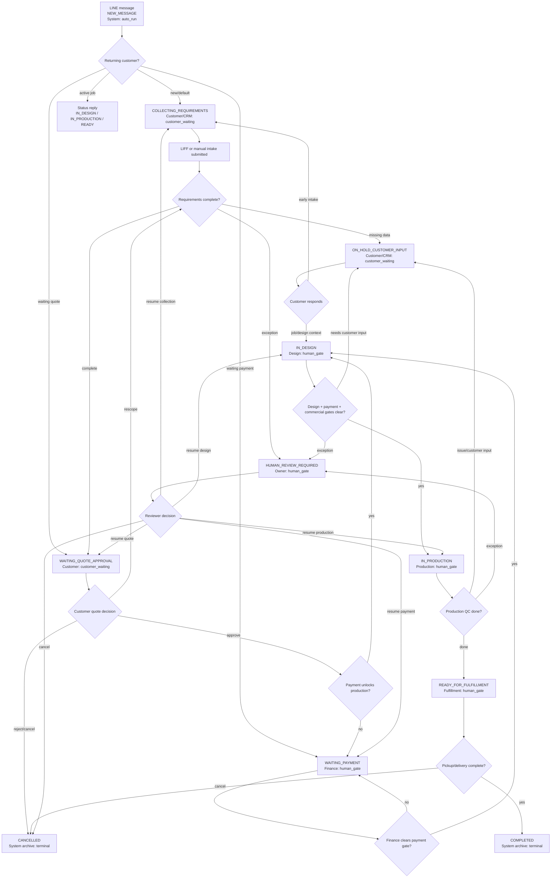

# FOGUS Auto-Run Flow Owner Map

อ่านไฟล์นี้ก่อนเมื่อต้องตอบคำถาม 4 ข้อนี้ให้เร็ว:

- ตอนนี้งานอยู่ state ไหน
- ใครเป็นเจ้าของ next action
- ระบบตัดสินใจอะไรเองได้
- อะไรเป็น gate ที่ทำให้งานยังไปต่อไม่ได้

ไฟล์นี้เป็นแผนที่สั้นสำหรับ recovery และ product review ไม่ใช่ source of truth ชุดใหม่ ถ้าจะเปลี่ยน behavior จริงให้แก้ตามลำดับนี้: `docs/workflow-policy.json` -> `src/lib/workflow-policy-core.mjs` / runtime routes -> `src/lib/workflow-owner-map.ts` -> derivative docs.

## Sources To Trust

| Source | Use for |
|---|---|
| `docs/workflow-policy.json` | Canonical state, transition, allowed CTA, payment/design/commercial rules |
| `src/lib/workflow-owner-map.ts` | Owner, automation mode, primary queue, stop reason, action surface |
| `docs/WORKFLOW_TRANSITION_TABLE.md` | Human-readable transition detail |
| `src/lib/quote-workflow.ts` | Quote approval and payment unlock decision |
| `src/app/api/intake/route.ts` | Intake completion and quote creation behavior |
| `src/app/api/quotes/[id]/approve/route.ts` | Customer approval route behavior |
| `src/app/api/quotes/[id]/commercial/route.ts` | Admin payment/commercial gate updates |
| `src/app/api/jobs/[id]/status/route.ts` | Job status transition enforcement |

## Legend

| Mode | Meaning | Human expectation |
|---|---|---|
| `auto_run` | ระบบควรเดินงานต่อเองเมื่อข้อมูลครบ | คนเข้ามาเฉพาะ exception |
| `customer_waiting` | ลูกค้าคือคนที่ต้องทำ next action | ระบบตาม, แจ้งเตือน, resume เมื่อ customer reply กลับมา |
| `human_gate` | งานหยุดรอการตัดสินใจภายใน | ต้องมีเจ้าของ, reason, ปุ่ม action ที่ชัด |
| `terminal` | งานปิดแล้ว | ห้าม reuse conversation เดิมเป็น intake ใหม่ |

## One-Screen Flow

## State Ownership Table

| State | Owner | Mode | Primary surface | System does | Person/customer does | Continue decision |
|---|---|---|---|---|---|---|
| `NEW_MESSAGE` | System intake router | `auto_run` | `/admin?filter=new-leads` | Verify LINE event, create/find conversation, choose reply type | None by default | If new/default -> collect requirements; if existing -> route by current state |
| `COLLECTING_REQUIREMENTS` | CRM / intake ops | `customer_waiting` | `/liff/intake` | Validate submitted payload and normalize dimensions/files | Customer submits LIFF form or admin does manual intake | Submitted data moves to requirements review; unclear/unsupported input can hold or escalate |
| `REQUIREMENTS_REVIEW` | CRM / sales admin | `auto_run` | `/admin?filter=new-leads` | Decide if data is quote-ready; create quote when possible | Admin reviews only pricing/data exceptions | Complete -> `WAITING_QUOTE_APPROVAL`; missing -> `ON_HOLD_CUSTOMER_INPUT`; exception -> `HUMAN_REVIEW_REQUIRED` |
| `WAITING_QUOTE_APPROVAL` | Sales / admin | `customer_waiting` | `/quote/[token]` | Serve quote, enforce allowed quote CTAs, process decision | Customer approves, rejects, or asks to rescope | Approve -> payment unlock check; rescope -> review; reject/cancel -> terminal/cancel path |
| `WAITING_PAYMENT` | Finance | `human_gate` | `/admin/accounting` | Keep quote/job blocked until payment rule passes; create/reuse job when unlocked | Finance records payment status/terms; customer sends evidence | Unlocked -> `IN_DESIGN`; still unpaid -> remain; mismatch/unclear -> review |
| `IN_DESIGN` | Design / QA review | `human_gate` | `/admin/prompts` | Assist with AI preview, status notifications, route after design events | Design edits prompt, checks preview, sends preview, marks design status | Design approved or not required plus commercial/payment clear -> `IN_PRODUCTION`; revision/missing input -> hold; risk -> review |
| `IN_PRODUCTION` | Production / fulfillment | `human_gate` | `/admin?filter=production-ops` | Protect production from uncleared gates; notify customer status | Production executes job, uploads evidence, marks progress | QC done -> `READY_FOR_FULFILLMENT`; issue -> hold/review; cancellation -> `CANCELLED` |
| `READY_FOR_FULFILLMENT` | Production / fulfillment | `human_gate` | `/admin?filter=production-ops` | Notify ready status and prepare completion record | Staff confirms pickup/delivery and completion package | Fulfilled -> `COMPLETED`; blocked/disputed -> review/cancel |
| `ON_HOLD_CUSTOMER_INPUT` | CRM / follow-up | `customer_waiting` | `/admin/follow-up` | Track missing input, send reminders, resume when reply arrives | Customer supplies missing detail or revision feedback | Early intake reply -> collection/review; design feedback -> back to design; no clear path -> review |
| `HUMAN_REVIEW_REQUIRED` | Owner / reviewer | `human_gate` | `/admin?filter=exceptions` | Stop automation, log reason, preserve context | Owner/reviewer decides resume state or cancellation | Resume to the correct previous lane or cancel; never silently continue |
| `COMPLETED` | System archive | `terminal` | `/status/[token]` | Keep history visible, close active queue ownership | Customer may start fresh intake only | No reuse; new work starts a new conversation/intake |
| `CANCELLED` | System archive | `terminal` | `/status/[token]` | Keep cancel reason/history visible | Customer may start fresh intake only | No reuse; new work starts a new conversation/intake |

## Decision Rules That Keep Work Moving

### 1. LINE Re-entry Decision

When a returning customer sends LINE text, the webhook should not show the same choice for every state.

| Current situation | Reply type | Why |
|---|---|---|
| `WAITING_QUOTE_APPROVAL` | quote approval context | Customer already submitted intake; do not offer fresh/resume |
| `WAITING_PAYMENT` | payment context | Customer already approved quote; move toward payment evidence/status |
| `IN_DESIGN`, `IN_PRODUCTION`, `READY_FOR_FULFILLMENT` | production status | Customer needs current job status, not intake restart |
| reusable `COLLECTING_REQUIREMENTS`, `REQUIREMENTS_REVIEW`, `ON_HOLD_CUSTOMER_INPUT` | resume or fresh | Only early intake states may continue old intake or start fresh |
| previous `COMPLETED` / `CANCELLED` | terminal fresh intake | Old conversation is closed; new work needs new intake |

### 2. Intake Decision

`POST /api/intake` is the first automation decision point.

- Complete enough for quote -> create quote -> `WAITING_QUOTE_APPROVAL`.
- Missing data -> `ON_HOLD_CUSTOMER_INPUT` with follow-up reason.
- Pricing/product/risk exception -> `HUMAN_REVIEW_REQUIRED`.

### 3. Quote Approval Decision

Quote approval runs the payment unlock matrix.

| Payment term | Unlocks production when |
|---|---|
| `credit` | immediately when policy treats payment as not required or already paid |
| `deposit` | payment status is `partial` or `paid` |
| `prepaid` | payment status is `paid` |

If unlocked, the system creates or reuses a job and moves to `IN_DESIGN`. If not unlocked, it parks at `WAITING_PAYMENT` and no production job should start.

### 4. Design And Production Gate Decision

Production cannot start only because a quote is approved. Before `IN_PRODUCTION`, these must be clear:

- payment gate is cleared
- design is approved or no design approval is required
- required commercial document gate is issued or explicitly not required
- no active human review blocker exists

### 5. Human Review Decision

`HUMAN_REVIEW_REQUIRED` is the stop sign for automation. A reviewer must choose one explicit path:

- resume to the correct prior lane
- request more customer input
- cancel the job/request

The system should never guess its way out of this state.

### 6. Terminal Decision

`COMPLETED` and `CANCELLED` are closed history. They can be shown on status/customer history surfaces, but must not be reused as the conversation for a new intake.

## UI Implication

Admin UI should not start from a giant table. Each queue card should answer:

- Owner: who is responsible now
- Mode: auto-run, customer-waiting, human-gate, or terminal
- Stop reason: why the work cannot move by itself
- Primary action: the one button that moves the work toward the next state
- Evidence: payment/design/commercial/customer proof needed before moving

The next implementation packet should consume `src/lib/workflow-owner-map.ts` so admin queues display owner, mode, stop reason, and action surface directly from the executable contract.

## Recovery Shortcut

When context is short, read this file first, then read only the exact source needed for the current task:

- changing workflow behavior -> `docs/workflow-policy.json`
- changing owner/queue UI -> `src/lib/workflow-owner-map.ts`
- changing quote/payment routing -> `src/lib/quote-workflow.ts`
- changing LINE re-entry -> `src/lib/webhook-returning-customer.ts`
- changing intake -> `src/app/api/intake/route.ts`
- changing job transition -> `src/app/api/jobs/[id]/status/route.ts`