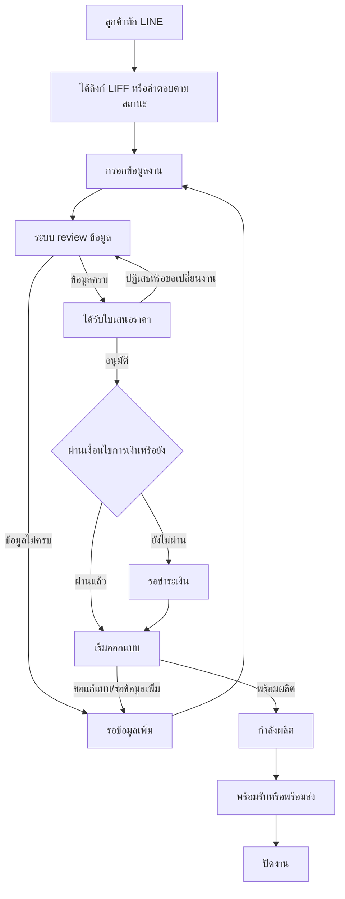
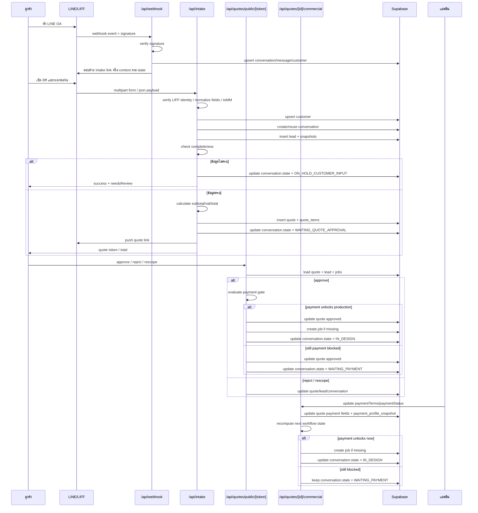

# เอกสารอธิบายภาพรวมระบบ โฟลวจริง และเหตุผลที่งานใช้เวลานาน

## สรุปสั้นที่สุด

### ตอนนี้งานอยู่จุดไหน

ถ้าสรุปแบบสั้นที่สุด ตอนนี้งานอยู่ที่:

- `Phase 1 ผ่านแล้ว`
- `Phase 2 ผ่านบางส่วนแล้ว` แต่ยังเหลือ gate ฝั่ง environment จริงอีก 4 จุด
- `Phase 3 แบบ live end-to-end ยังรอการรันจริงเป็นหลัก`
- สถานะรวมยังเป็น `NO-GO` จนกว่าจะปิด verification ในโลกจริงครบ
- รูปแบบการเดินงานปัจจุบันคือ `human-guided automation`

ถ้าพูดเป็นภาษาง่าย:

`โครงหลักของระบบค่อนข้างนิ่งแล้ว แต่ยังอยู่ในช่วงยืนยันของจริงก่อนปล่อยเต็ม`

กรอบเวลาที่ควรใช้มองตอนนี้คือ:

- เร็วที่สุด `3-7 วันทำการ`
- กรณีปกติ `1-3 สัปดาห์`
- ถ้ามี blocker จริง `เกิน 3 สัปดาห์`

รายละเอียดว่าทำไมยังอยู่จุดนี้ และเวลาเหล่านี้คิดจากอะไร จะอธิบายต่อในหัวข้อด้านล่าง

FOGUS ไม่ใช่แค่เว็บรับฟอร์ม แต่เป็นระบบ workflow สำหรับพาร้านจาก:

`ลูกค้าทัก LINE -> เก็บ requirement -> สร้างใบเสนอราคา -> รออนุมัติ -> เช็กการชำระเงิน -> เปิดงานออกแบบ -> เข้าผลิต -> พร้อมส่งมอบ -> ปิดงาน`

ความยากของระบบไม่ได้อยู่ที่เส้นทางหลักเพียงเส้นเดียว แต่อยู่ที่โลกจริงมีทางแยกและการวนกลับจำนวนมาก เช่น:

- ลูกค้ากรอกข้อมูลไม่ครบ
- ลูกค้าเปลี่ยน requirement กลางทาง
- ลูกค้าอนุมัติราคาแล้วแต่ยังไม่ผ่านเงื่อนไขการชำระเงิน
- ลูกค้าขอแก้แบบหลายรอบ
- ลูกค้าเก่ากลับมาคุยต่อเรื่องเดิมหรือเริ่มงานใหม่
- AI หรือ agent ที่ช่วยงานยังมีโอกาสหลุดบริบท จึงต้องมีการสร้าง guardrail และขั้นตอนอุดช่องโหว่เพิ่มเรื่อย ๆ

ดังนั้นสถานะปัจจุบันของระบบคือ:

`human-guided automation`

หมายถึง ระบบเป็นโครงหลักในการเดินงานแล้ว แต่ยังต้องมีคนคุมจุดเสี่ยงก่อน จนกว่าจะมั่นใจว่าปล่อย automation เต็มขึ้นแล้วธุรกิจจะไม่เสียหาย

---

## จุดประสงค์ของเอกสารนี้

เอกสารนี้จัดทำขึ้นเพื่อให้ลูกค้าและผู้เกี่ยวข้องเห็นภาพเดียวกันว่า:

1. ระบบนี้กำลังพา workflow อะไรตั้งแต่ต้นจนจบ
2. จุดใดในระบบที่ตั้งใจให้เป็น automation
3. จุดใดที่ยังต้องให้คนคุมอยู่ก่อนเพื่อไม่ให้ธุรกิจเสียหาย
4. ทำไมงานจึงใช้เวลานานและยากกว่าที่เห็นจากหน้าจอเพียงไม่กี่หน้า
5. แผนล่าสุดของทีมตอนนี้คืออะไร และกำลังปิดงานส่วนไหนอยู่จริง

เอกสารนี้จัดทำขึ้นเพื่ออธิบายสภาพงานจริงอย่างตรงไปตรงมา โดยชี้ให้เห็นว่าความยากของงานไม่ได้อยู่ที่การทำหน้าจอไม่กี่หน้า แต่อยู่ที่การทำให้ธุรกิจเดินได้จริงโดยไม่หลุดราคา หลุดสถานะ หลุดการชำระเงิน หรือหลุดการส่งมอบ

---

## 1. เป้าหมายของระบบนี้จริง ๆ คืออะไร

เป้าหมายสุดท้ายของระบบมี 4 ชั้น:

1. ทำให้ลูกค้าเริ่มงานได้เองจาก LINE โดยไม่ต้องรอแอดมินถามทีละคำถาม
2. ทำให้ข้อมูลจากแชตถูกแปลงเป็นข้อมูลธุรกิจที่เอาไปคิดราคา เปิดงาน และติดตามงานได้
3. ทำให้การอนุมัติราคา การรอชำระเงิน การออกแบบ การผลิต และการส่งมอบ เดินตาม state เดียวกันทั้งระบบ
4. ทำให้ระบบพา workflow ได้อัตโนมัติให้มากที่สุด โดยยังคุมความเสี่ยงทางธุรกิจได้

ถ้าระบบนี้ทำงานสมบูรณ์ ลูกค้าไม่ควรต้องอาศัยการประสานงานแบบ manual ทุกขั้น และทีมงานไม่ควรต้องเปิดหลายที่เพื่อเดาว่างานอยู่ตรงไหน

---

## 2. วิธีอ่าน flow นี้

เอกสารนี้ต้องอ่านเป็น 3 ชั้น เพราะถ้าอ่านแค่ชั้นเดียวจะเห็นเพียงโฟลวหน้าบ้าน แต่ไม่เห็น logic ที่ทำให้ระบบต้องวน ต้องหยุด หรือยังต้องใช้คนคุม:

1. `เส้นทางที่มองเห็น` คือสิ่งที่ลูกค้าและทีมงานเห็นบน LINE, LIFF, quote page, status page, และหน้า admin
2. `เส้นทางทางเทคนิคที่มองไม่เห็น` คือ webhook, route, database write, state transition, payment gate, และ action log ที่ทำงานอยู่เบื้องหลัง
3. `เงื่อนไขตัดสินใจ` คือกฎ if-then ที่บอกว่าจากจุดหนึ่งงานจะเดินหน้า ย้อนกลับ หยุดรอ หรือถูกส่งให้คนดูแล

ถ้าจะเข้าใจว่าทำไมงานนี้ยาก ต้องเห็นทั้ง 3 ชั้นพร้อมกัน

### 2.1 วิธีอ่านเรื่องเวลาในเอกสารนี้

นอกจากอ่าน flow แล้ว เอกสารนี้ยังใช้กรอบคิดเรื่องเวลาแบบ `execution reality` ด้วย หมายความว่าเวลาที่พูดถึงในเอกสารไม่ได้คิดจากเวลาเขียนโค้ดอย่างเดียว แต่คิดจากเวลาที่ต้องทำให้งานเดินได้จริงในโลกใช้งานจริงด้วย

กรอบนี้มี 4 ชั้น:

1. `build time` คือเวลาออกแบบ แก้โค้ด ปรับ logic และจัดโครงระบบ
2. `supervision time` คือเวลาที่ต้องคอยคุม Copilot/AI, อ่านผล, กดรัน, ตอบกลับ, และบังคับให้กลับเข้า scope ที่ถูกต้อง
3. `verification time` คือเวลาตรวจซ้ำ, เทสซ้ำ, เช็ก console, เช็ก environment, และเก็บ evidence ว่าสิ่งที่ผ่านใน local ผ่านในโลกจริงด้วย
4. `hidden-bug time` คือเวลาสำหรับบั๊กหรือความคลาดเคลื่อนที่ยังไม่เห็นในรอบแรก แต่โผล่ตอนเชื่อม flow จริง, UAT จริง, หรือ production-like environment

เพราะฉะนั้น เวลาที่ประเมินในเอกสารนี้เป็นเวลาของ `การพาระบบให้เดินได้จริง` ไม่ใช่เวลาของ `การเขียนให้เหมือนเสร็จ`

---

## 3. เส้นทางที่มองเห็นได้จริง

### 3.1 เส้นทางที่ลูกค้าเห็น

`ลูกค้าทัก LINE`
-> `ได้รับลิงก์หรือคำตอบที่เหมาะกับสถานะปัจจุบัน`
-> `เปิด LIFF`
-> `กรอกข้อมูลงาน`
-> `ส่งฟอร์ม`
-> `ได้รับใบเสนอราคา`
-> `อนุมัติหรือปฏิเสธ`
-> `ถ้ายังไม่ผ่านเงื่อนไขการเงิน ระบบแจ้งว่ารอชำระเงิน`
-> `ถ้าพร้อมแล้ว งานเข้าสู่ออกแบบ`
-> `ลูกค้าดูความคืบหน้าหรือขอแก้แบบ`
-> `งานเข้าสู่ผลิต`
-> `งานพร้อมรับหรือพร้อมส่ง`
-> `ปิดงาน`

### 3.2 เส้นทางที่ทีมงานเห็น

`มี conversation ใหม่เข้าระบบ`
-> `เห็น requirement ที่ลูกค้ากรอก`
-> `ตรวจว่าข้อมูลครบพอออก quote หรือยัง`
-> `เห็น quote ถูกสร้างและส่งรออนุมัติ`
-> `ถ้ายังติด payment จะเห็นงานค้างที่ WAITING_PAYMENT`
-> `เมื่อผ่านเงื่อนไขจะเห็นงานเข้า IN_DESIGN`
-> `ติดตามการส่งแบบและรอบแก้ไข`
-> `เมื่อพร้อมจึงขยับไป IN_PRODUCTION`
-> `จากนั้นไป READY_FOR_FULFILLMENT`
-> `และปิดเป็น COMPLETED`

### 3.3 ตาราง mapping ของสิ่งที่มองเห็น

| ช่วงของงาน | ลูกค้าเห็นอะไร | ทีมงานเห็นอะไร | ความหมายทางธุรกิจ |
|---|---|---|---|
| เริ่มต้น | LINE chat และลิงก์ LIFF | conversation ใหม่ในระบบ | เริ่มเก็บงานตั้งแต่ข้อความแรก |
| เก็บ requirement | แบบฟอร์ม LIFF | ข้อมูล lead/intake | เปลี่ยนแชตเป็นข้อมูลที่ใช้คิดราคาได้ |
| review ข้อมูล | สถานะรอประมวลผล | requirement review / hold | ถ้าข้อมูลไม่ครบ หยุดก่อนเพื่อไม่ให้คิดงานผิด |
| quote | หน้าใบเสนอราคา | quote record และสถานะ sent | ลูกค้าตัดสินใจบนข้อมูลชุดเดียวกับทีม |
| payment gate | ข้อความหรือสถานะรอชำระเงิน | WAITING_PAYMENT | อนุมัติราคาแล้วไม่ได้แปลว่าเริ่มงานได้ทันที |
| design | ความคืบหน้า/รอบแก้แบบ | IN_DESIGN และ design status | เปิดงานออกแบบเมื่อพร้อมจริง |
| production | สถานะกำลังผลิต | IN_PRODUCTION | เริ่มผลิตเมื่อผ่านกติกาแล้ว |
| fulfillment | พร้อมรับ/พร้อมส่ง | READY_FOR_FULFILLMENT | รอปิดงานอย่างเป็นทางการ |
| complete | งานเสร็จสิ้น | COMPLETED | ใช้ตรวจสอบย้อนหลังและทำซ้ำได้ |

### 3.4 ภาพเส้นทางที่คนทั่วไปอ่านได้ในหน้าเดียว



---

## 4. เส้นทางทางเทคนิคที่มองไม่เห็น

ส่วนนี้คือสิ่งที่ลูกค้าไม่เห็นโดยตรง แต่เป็นตัวที่ทำให้ระบบออโต้ได้จริง และเป็นเหตุผลว่าทำไมงานนี้ไม่ได้มีแค่หน้า UI

| จังหวะที่คนมองเห็น | trigger / route หลัก | สิ่งที่ระบบทำเบื้องหลัง | ข้อมูลที่ถูกเขียนหรืออัปเดต | ผลลัพธ์ |
|---|---|---|---|---|
| ลูกค้าทัก LINE ครั้งแรก | `POST /api/webhook` | ตรวจ signature, หา customer เดิม, สร้าง conversation/message ถ้ายังไม่มี | conversation, message, action log | เข้า `NEW_MESSAGE` แล้วตัดสินการตอบกลับ |
| ระบบตอบลูกค้า | webhook routing | เลือกว่าจะส่ง intake link, quote context, payment context, status context, หรือ escalation path | reply decision, state context | ลูกค้าเห็นข้อความที่สอดคล้องกับสถานะจริง |
| ลูกค้าเปิด LIFF | `/liff` และ `/liff/intake` | init LIFF, อ่าน context, friendship, prefill ลูกค้าเดิม, โหลด catalog | LIFF context snapshot, prefill data | ลดการกรอกซ้ำและรักษาบริบทลูกค้า |
| ลูกค้าส่งฟอร์ม intake | `POST /api/intake` | parse form, validate, สร้าง/อัปเดต customer, lead, quote, snapshot fields | customers, leads, quotes, conversation state, action log | ไป `REQUIREMENTS_REVIEW` แล้วแตกไป hold หรือ quote approval |
| ระบบประเมินความครบถ้วน | intake decision logic | เช็กว่าข้อมูลครบพอออก quote อัตโนมัติหรือไม่ | conversation state | ถ้าครบไป `WAITING_QUOTE_APPROVAL`, ถ้าไม่ครบไป `ON_HOLD_CUSTOMER_INPUT` |
| ลูกค้าเปิดใบเสนอราคา | `/quote/[token]` | อ่าน quote, token, totals, CTA contract | read-only quote/session context | ลูกค้าเห็นสิ่งที่อนุมัติได้จริง |
| ลูกค้าอนุมัติหรือปฏิเสธ quote | `POST /api/quotes/public/[token]` และ approval flow | validate token, อัปเดต quote status, ตัดสิน payment unlock, อาจสร้าง job หรือยังไม่สร้าง | quotes, conversation state, jobs, action log | ไป `REQUIREMENTS_REVIEW`, `WAITING_PAYMENT`, หรือ `IN_DESIGN` |
| แอดมินอัปเดต payment/commercial | `POST /api/quotes/[id]/commercial` | ปรับ payment term/status แล้วประเมิน unlock ใหม่ | quotes, conversation state, action log | ถ้ายังไม่ผ่านค้าง `WAITING_PAYMENT`, ถ้าผ่านไป `IN_DESIGN` |
| ทีมทำงานออกแบบ | design / preview state handling | เก็บ design status, ส่ง preview, รับ revision, บันทึกสถานะทีมกับลูกค้า | leads, design status, conversation state | รักษารอบแก้แบบโดยไม่ทำให้ state หลุด |
| แอดมินเริ่มผลิตหรือขยับสถานะงาน | `POST /api/jobs/[id]/status` | validate transition, update job status, sync conversation state | jobs, conversation state, action log | ไป `IN_PRODUCTION`, `READY_FOR_FULFILLMENT`, หรือ `COMPLETED` |
| ลูกค้าติดตามสถานะ | `/status/[token]` | อ่าน timeline และสถานะล่าสุด | status view context | ลูกค้าเห็นความคืบหน้าเดียวกับทีม |
| ลูกค้าพิมพ์คำขอคุยกับคน | webhook escalation detection | ตรวจ keyword เช่น `admin`, `คุยกับแอดมิน` แล้วเปลี่ยน state | conversation state, action log | ไป `HUMAN_REVIEW_REQUIRED` |

### 4.1 สิ่งที่ระบบต้องคุมเบื้องหลังตลอดเวลา

นอกจาก route แต่ละตัวแล้ว ระบบยังต้องคุม 5 เรื่องนี้พร้อมกันเสมอ:

1. `conversation state` ต้องตรงกับ stage ของธุรกิจ
2. `quote status` ต้องตรงกับสิ่งที่ลูกค้าตัดสินใจจริง
3. `payment status` ต้องไม่ปลดล็อกงานเร็วเกินกติกา
4. `job status` ต้องไม่ขยับข้ามขั้น
5. `action log` ต้องบอกย้อนหลังได้ว่าใครทำอะไร เมื่อไร และทำให้ state เปลี่ยนอย่างไร

### 4.2 ค่า config อยู่ที่ไหน และถูก resolve อย่างไร

ระบบนี้ไม่ได้อ่านค่าจาก env อย่างเดียว แต่มี runtime settings ที่เขียนทับ env ได้ในบางจุด โดยลำดับที่ใช้จริงเป็นแบบนี้:

| ค่า | รับจากไหนก่อน | ถ้าไม่มีจึง fallback ไป | ค่าที่ระบบใช้จริง | ใช้เพื่ออะไร |
|---|---|---|---|---|
| `baseUrl` | `app_settings.base_url` | `NEXT_PUBLIC_BASE_URL` | `RuntimeAppConfig.baseUrl` | ใช้สร้างลิงก์ public ทุกตัว |
| `webhookUrl` | สร้างจาก `baseUrl` | ไม่มีค่าแยก | `baseUrl + /api/webhook` | ใช้เป็น URL ที่ต้องไปลงใน LINE Messaging API console |
| `liffEndpointUrl` | สร้างจาก `baseUrl` | ไม่มีค่าแยก | `baseUrl + /liff` | ใช้เป็น URL ที่ต้องไปลงใน LIFF console |
| `lineChannelAccessToken` | `app_settings.line_channel_access_token` | `LINE_CHANNEL_ACCESS_TOKEN` | token สำหรับ LINE client | ใช้ส่ง reply/push message |
| `lineChannelSecret` | `app_settings.line_channel_secret` | `LINE_CHANNEL_SECRET` | secret สำหรับ verify webhook | ใช้ตรวจ `x-line-signature` |
| `liffId` | `app_settings.liff_id` | `NEXT_PUBLIC_LIFF_ID` หรือ `LIFF_ID` | LIFF ID ตัวเดียวที่ runtime ใช้ | ใช้ init LIFF ฝั่ง browser |
| `aiImageProvider` | `app_settings.ai_image_provider` | ค่า default `openai` | provider ที่ runtime จะใช้ | คุมเส้นทาง AI preview |
| `aiImageModel` | `app_settings.ai_image_model` | ค่า default `gpt-image-1` | model ที่ runtime จะใช้ | คุมการ generate preview |
| `aiImageApiKey` | `app_settings.ai_image_api_key` | `OPENAI_API_KEY` | key ฝั่ง server | ใช้เรียก provider |

สรุปเชิงเทคนิค:

1. ค่าหลายตัวถูก override ได้จากหน้า `/admin/settings`
2. ถ้า runtime settings ไม่มี จึงค่อย fallback ไป env vars
3. เพราะฉะนั้นเวลา debug ต้องดูทั้ง `app_settings` และ env พร้อมกัน ไม่ใช่ดูแค่ `.env` หรือ Vercel อย่างเดียว

### 4.3 ค่าจาก LINE และ LIFF ถูกแปลงเป็นอะไร แล้วเก็บที่ไหน

| ค่าที่เข้ามา | ระบบทำอะไร | variable/ค่ากลาง | ถูกเก็บที่ไหน |
|---|---|---|---|
| `x-line-signature` จาก webhook | verify signature ก่อนรับ event | ผ่านหรือไม่ผ่าน | ถ้าไม่ผ่านจะตอบ `401` และไม่เขียน event ต่อ |
| `event.source.userId` จาก LINE | ใช้เป็น customer identity หลัก | `userId` | `conversations.line_user_id`, `customers.line_user_id` |
| `liffIdToken` | verify ตัวตนจาก LIFF | `intakeIdentity` | ใช้ resolve `userId`, `displayName`, `email`, `pictureUrl` |
| `liffAccessToken` | เรียก profile enrichment เพิ่ม | `verifiedAccessProfile` | ใช้เติม `statusMessage`, `friendshipStatus`, `scope`, `expiresIn` |
| profile ที่ verify แล้ว | รวมเป็น profile snapshot | `liffProfileSnapshot` | `customers.last_liff_profile`, `leads.liff_profile_snapshot` |
| context จาก LIFF | parse/normalize context | `liffContextSnapshot` | `customers.last_liff_context`, `leads.liff_context_snapshot` |
| display name จาก LINE profile | upsert customer | `displayName` | `customers.display_name` |

สรุปเชิงเทคนิค:

1. ฝั่ง customer identity ไม่ได้เชื่อค่า text จากฟอร์มตรง ๆ อย่างเดียว แต่พยายาม verify ผ่าน LIFF token ก่อน
2. customer table เก็บ profile ล่าสุดในระดับลูกค้า
3. lead table เก็บ snapshot ของ profile/context ณ เวลาที่ส่งฟอร์ม เพื่อให้ย้อนดูได้ว่า lead นี้ถูกสร้างด้วยบริบทอะไร

### 4.4 ค่าจากฟอร์ม intake ไปไหนบ้าง

| field จากฟอร์ม | ระบบแปลงเป็น | ถูกเก็บที่ไหน | หมายเหตุ |
|---|---|---|---|
| `productType` | `product_type`, `productLabel`, `category snapshots` | `leads.product_type`, `product_label_snapshot`, `product_category_snapshot`, `product_category_label_snapshot` | ถ้ามี product catalog จะ resolve label จาก catalog ก่อน |
| `width`, `height`, `unit` | `widthMm`, `heightMm` | `leads.width_mm`, `leads.height_mm` | ทุกหน่วยถูก normalize เป็น mm ก่อน |
| `qty` | `qty` | `leads.qty` | ใช้ตอนคิดราคาและสร้าง quote item label |
| `dueDate` | `due_date` | `leads.due_date` | validate ว่าต้องไม่ย้อนหลัง |
| `phone` | `phone` | `customers.phone` | ข้อมูลลูกค้าระดับ customer |
| `note` | `note_from_form` | `leads.note_from_form` | note จากฟอร์ม intake |
| `referenceInfo` | `reference_info` | `leads.reference_info` | ข้อมูลอ้างอิงที่ลูกค้าพิมพ์เพิ่ม |
| `referenceFiles` | upload media | storage + lead media metadata | ถ้า upload fail จะไม่ rollback lead แต่ส่ง warning กลับ |
| `aiImagePrompt` | `ai_image_prompt` และ flag สถานะ AI | `leads.ai_image_prompt`, `leads.ai_image_status` | ถ้ามี prompt = `pending`, ถ้าไม่มี = `not_requested` |
| `requestedDocumentType` | `requested_document_type` | `leads.requested_document_type` | เช่น quote / tax invoice |
| `billingEntityType` | `billing_entity_type` | `leads.billing_entity_type` | company หรือ person |
| `billingBranchType` | `billing_branch_type` | `leads.billing_branch_type` | ใช้เฉพาะกรณีนิติบุคคล |
| `billingBranchCode` | `billing_branch_code` | `leads.billing_branch_code` | บังคับสำหรับบางกรณี tax invoice |
| `billingName` | `billing_name` | `leads.billing_name` | ชื่อออกเอกสาร |
| `taxId` | `tax_id` | `leads.tax_id` | เลขผู้เสียภาษี |
| `billingAddress` | `billing_address` | `leads.billing_address` | ที่อยู่ออกเอกสาร |
| `fulfillmentMode` | `fulfillment_mode` | `leads.fulfillment_mode` | ถ้าไม่ส่งมาจะใช้ default จาก workflow helper |
| `fulfillmentAddressLine1/2` | address fields | `leads.fulfillment_address_line1/2` | เก็บเฉพาะกรณี delivery หรือ install |
| `fulfillmentSubdistrict/District/Province/PostalCode` | normalized location fields | `leads.fulfillment_subdistrict`, `fulfillment_district`, `fulfillment_province`, `fulfillment_postal_code` | ใช้ส่งมอบ/ติดตั้ง |
| `fulfillmentLatitude/Longitude` | numeric lat/lng | `leads.fulfillment_latitude`, `fulfillment_longitude` | ต้องมาครบคู่และอยู่ในช่วงที่ถูกต้อง |
| `intakeMode` | fresh/resume decision | ใช้ใน decision logic และ action log payload | มีผลว่าจะ reuse conversation เดิมหรือสร้างใหม่ |

กฎสำคัญที่ route นี้ใช้ก่อนเขียนลงฐานข้อมูล:

1. ถ้า `fulfillmentMode` เป็น `delivery` หรือ `install` ต้องมีที่อยู่จัดส่งหลักให้ครบ
2. ถ้าเป็น `company + tax_invoice + branch` ต้องมี `billingBranchCode`
3. latitude/longitude ต้องเป็นตัวเลขที่ valid และต้องมาครบทั้งคู่

### 4.5 ค่าราคา, quote, token, และ state ถูกสร้างอย่างไร

| ค่า | มาจากไหน | ถูกเก็บที่ไหน | ใช้ต่ออย่างไร |
|---|---|---|---|
| `subtotal` | `calculateProductCatalogPrice()` หรือ `calculatePrice()` | `quotes.subtotal` | ใช้เป็นฐานคำนวณ VAT และ total |
| `vat` | `subtotal * 0.07` | `quotes.vat` | แสดงใน quote |
| `total` | `subtotal + vat` | `quotes.total` | ใช้ใน payment routing และ customer-facing totals |
| `paymentTerms` | มาจากฟอร์มหรือ default เป็น `prepaid` | `quotes.payment_terms` | ใช้ตัดสิน payment gate |
| `paymentStatus` ตอนสร้าง quote | ถ้า `credit` = `not_required`, กรณีอื่น = `unpaid` | `quotes.payment_status` | ใช้ตัดสินว่าจะ unlock production หรือยัง |
| `paymentProfileSnapshot` | resolve จาก runtime app config + quote total + billing entity + payment term | `quotes.payment_profile_snapshot` | ทำให้ quote รู้ว่าควรแสดงข้อมูลชำระเงินแบบไหน |
| `public_token` | สร้างตอน insert quote | `quotes.public_token` | ใช้เป็น token สำหรับหน้า `/quote/[token]` และ push link ให้ลูกค้า |
| quote item label | ประกอบจาก product label + ขนาด + qty | `quote_items.label` | ใช้แสดงรายการในใบเสนอราคา |
| state หลังออก quote สำเร็จ | update conversation | `conversations.state = WAITING_QUOTE_APPROVAL` | พาลูกค้าเข้าสู่ช่วงตัดสินใจอนุมัติราคา |

เส้นทางหลังจากลูกค้ากด approve quote:

| เงื่อนไข | ระบบอัปเดตค่าอะไร | ปลายทาง |
|---|---|---|
| quote ถูก approve | `quotes.status = approved` และ `leads.status = approved` | เข้าสู่ payment gate |
| `credit` | `payment_status` ถูก normalize เป็น `not_required` | ไป `IN_DESIGN` ได้ทันที |
| `deposit` + `partial/paid` | payment gate ผ่าน | ไป `IN_DESIGN` |
| `prepaid` + `paid` | payment gate ผ่าน | ไป `IN_DESIGN` |
| payment gate ยังไม่ผ่าน | update `conversations.state = WAITING_PAYMENT` | งานยังไม่ถูกเปิดต่อ |
| payment gate ผ่าน | create job ถ้ายังไม่มี | `jobs.status = IN_DESIGN`, `conversations.state = IN_DESIGN` |

เส้นทางเมื่อแอดมินอัปเดต commercial/payment:

1. route รับ `paymentTerms` และ/หรือ `paymentStatus`
2. normalize ค่า เช่น `credit + unpaid` จะถูกย้ายเป็น `not_required`
3. update `quotes.payment_terms`, `quotes.payment_status`, `quotes.payment_profile_snapshot`
4. ถ้า quote status เป็น `approved` แล้ว ระบบจะคำนวณ `nextWorkflowState`
5. ถ้า payment unlock แล้วและยังไม่มี job ระบบจะสร้าง job ให้

ดังนั้นในเชิงเทคนิค งานไม่ได้ไหลเพราะหน้าจออย่างเดียว แต่ไหลเพราะค่าพวกนี้ถูกคำนวณและเขียนลงหลายตารางพร้อมกันอย่างสอดคล้องกัน

### 4.6 Sequence diagram เชิงเทคนิค

ภาพนี้อธิบายแบบ request-by-request ว่าเมื่อคนใช้งานเห็น 1 เหตุการณ์ ระบบทำอะไรต่อทีละชั้น:



สรุปเชิงเทคนิคจากภาพนี้:

1. ทุก request สำคัญไม่ได้เขียนแค่ตารางเดียว แต่กระทบหลายตารางพร้อมกัน
2. state ของ conversation เป็นตัวเชื่อมโลกของลูกค้า, quote, payment, design, และ job เข้าด้วยกัน
3. ถ้าค่าตัวใดตัวหนึ่งถูก normalize ผิด หรือเขียน state ผิดเพียงจุดเดียว ระบบทั้งเส้นจะหลุดทันที

---

## 5. เงื่อนไขตัดสินใจที่ชัดเจน

ส่วนนี้คือหัวใจว่าทำไม flow ดูเหมือนสั้น แต่ของจริงไม่ใช่เส้นตรงเดียว

### 5.1 Gate A: ลูกค้าเก่ากลับมา ระบบต้องตอบไม่เหมือนกันทุกครั้ง

| สถานะปัจจุบันของลูกค้า | ระบบควรตอบแบบไหน | เหตุผล |
|---|---|---|
| `COLLECTING_REQUIREMENTS`, `REQUIREMENTS_REVIEW`, `ON_HOLD_CUSTOMER_INPUT` | เสนอให้กลับไปทำต่อหรือเริ่ม request ใหม่ | เพราะยังอยู่ในช่วงเก็บ requirement |
| `WAITING_QUOTE_APPROVAL` | พาไปดู quote ที่รออนุมัติ | เพราะประเด็นหลักไม่ใช่เริ่มงานใหม่ แต่คือตัดสินใจเรื่อง quote |
| `WAITING_PAYMENT` | พาไปดูสถานะ payment | เพราะงานติด gate การเงิน ไม่ใช่ติด intake |
| `IN_DESIGN`, `IN_PRODUCTION`, `READY_FOR_FULFILLMENT` | พาไปดูสถานะงาน | เพราะลูกค้ามักถามความคืบหน้าของงานเดิม |
| `COMPLETED`, `CANCELLED` | เชิญเริ่ม intake ใหม่ | เพราะงานเก่าจบแล้วและไม่ควรถูก reuse |

### 5.2 Gate B: ข้อมูลครบพอให้ระบบออก quote อัตโนมัติหรือยัง

| เงื่อนไข | ถ้าจริง | ถ้าไม่จริง |
|---|---|---|
| ข้อมูล requirement ครบตามกติกา | สร้าง quote และไป `WAITING_QUOTE_APPROVAL` | ไป `ON_HOLD_CUSTOMER_INPUT` เพื่อรอข้อมูลเพิ่ม |

นี่คือจุดแรกที่ระบบต้องเลือกว่าจะเดินหน้าอัตโนมัติ หรือหยุดให้คนหรือลูกค้าช่วยเติมข้อมูลก่อน

### 5.3 Gate C: ลูกค้าตอบรับ quote อย่างไร

| การตัดสินใจของลูกค้า | ผลลัพธ์ |
|---|---|
| อนุมัติ quote | ไปเช็ก payment gate ต่อ |
| ปฏิเสธ quote หรือขอทบทวนใหม่ | กลับไป `REQUIREMENTS_REVIEW` |

หมายความว่า quote ไม่ใช่ปลายทาง แต่เป็นประตูอีกบานหนึ่งของ workflow

### 5.4 Gate D: Payment gate ปลดล็อกหรือยัง

| payment term | payment status ที่ถือว่าผ่าน | ถ้าผ่าน | ถ้ายังไม่ผ่าน |
|---|---|---|---|
| `credit` | `not_required` หรือ `paid` | ไป `IN_DESIGN` | โดยปกติไม่ควรติดนาน ถ้ายังไม่ผ่านต้องให้แอดมินตรวจข้อมูล |
| `deposit` | `partial` หรือ `paid` | ไป `IN_DESIGN` | ค้าง `WAITING_PAYMENT` |
| `prepaid` | `paid` เท่านั้น | ไป `IN_DESIGN` | ค้าง `WAITING_PAYMENT` |

จุดนี้คือเหตุผลสำคัญที่คำว่า “ลูกค้าอนุมัติแล้ว” ไม่เท่ากับ “เริ่มงานได้แล้ว”

### 5.5 Gate E: งานออกแบบพร้อมไปผลิตหรือยัง

| เงื่อนไข | ถ้าผ่าน | ถ้ายังไม่ผ่าน |
|---|---|---|
| payment ผ่านกติกา และ design ผ่านเงื่อนไขที่อนุญาต | ไป `IN_PRODUCTION` | ค้าง `IN_DESIGN` หรือย้อนเป็น `ON_HOLD_CUSTOMER_INPUT` |

ในทางปฏิบัติ จุดนี้มักมี loop มากที่สุด เพราะลูกค้าอาจขอแก้แบบหลายรอบ หรือข้อมูลที่ใช้ผลิตยังไม่พร้อม

### 5.6 Gate F: ลูกค้าขอคุยกับคนหรือมีเหตุการณ์พิเศษหรือไม่

| trigger | ผลลัพธ์ |
|---|---|
| พิมพ์คำว่า `admin`, `คุยกับแอดมิน`, `ขอคุยกับคน` หรือมีเหตุพิเศษที่ระบบไม่ควรตัดสินเอง | ไป `HUMAN_REVIEW_REQUIRED` |

นี่คือ safety valve ของระบบ เพื่อไม่ให้ automation ฝืนเดินต่อในเคสที่ควรมีคนรับไม้ต่อ

### 5.7 Gate G: terminal state

| สถานะ | ความหมายเชิงระบบ |
|---|---|
| `COMPLETED` | งานนี้จบแล้ว ไม่ควรถูกนำกลับมาใช้เป็น intake ใหม่ |
| `CANCELLED` | งานนี้ถูกยกเลิกแล้ว ไม่ควรถูก reuse เป็นงานใหม่ |

เงื่อนไขนี้สำคัญ เพราะถ้า reuse งานที่จบแล้ว ระบบจะปนบริบทเก่ากับงานใหม่ทันที

---

## 6. จุดที่ตั้งใจให้เป็น automation

ระบบนี้ไม่ได้ต้องการให้คนทำทุกขั้นเหมือนเดิม เป้าหมายคือค่อย ๆ ย้ายงานซ้ำ ๆ ที่วัดกติกาได้ไปให้ระบบทำแทน โดยมี 9 จุดหลัก:

1. รับข้อความจาก LINE และแปลงเป็นเหตุการณ์ในระบบอัตโนมัติ
2. พาลูกค้าเข้าฟอร์ม LIFF และดึงข้อมูลบริบทที่ควรมี
3. ตรวจว่าข้อมูลครบหรือยัง
4. สร้าง lead และ quote อัตโนมัติเมื่อเข้าเงื่อนไข
5. คุม transition ของ workflow จาก state หนึ่งไปอีก state หนึ่ง
6. ตัดสิน payment gate ตามกติกาธุรกิจ
7. อัปเดตสถานะลูกค้าและฝั่งแอดมินให้ตรงกัน
8. บันทึก action log เพื่อไล่ย้อนว่าใครทำอะไรเมื่อไร
9. สร้างทางวิ่งให้ระบบขยับงานต่อเองได้มากขึ้นในอนาคต

---

## 7. ทำไมตอนนี้ยังต้องให้คนเข้ามาคั่นก่อน

แม้เป้าหมายคือ automation แต่ธุรกิจจริงยังต้องใช้คนคุมจุดเสี่ยงอยู่ก่อน ด้วยเหตุผลดังนี้:

### 7.1 ข้อมูลจากลูกค้าจริงไม่เคยสะอาดเท่าฟอร์มตัวอย่าง

ลูกค้าอาจ:

- กรอกข้อมูลไม่ครบ
- ใช้คำที่ระบบตีความไม่ตรง
- เปลี่ยน requirement กลางทาง
- ส่งข้อมูลเพิ่มทางแชตแทนการกรอกฟอร์ม

ถ้าปล่อย auto เต็มเกินไปในจังหวะนี้ ระบบอาจคิดราคาผิด เปิดงานผิด หรือพาไปสถานะผิด

### 7.2 การชำระเงินเป็นจุดที่ห้ามเดา

ในระบบนี้ ใบเสนอราคาที่อนุมัติแล้วไม่ได้แปลว่าเริ่มงานต่อได้ทันทีทุกกรณี

กติกาปัจจุบันคือ:

- `credit` ปลดล็อกได้ทันที
- `deposit` ต้องมีการชำระบางส่วนหรือเต็มจำนวน
- `prepaid` ต้องชำระครบก่อน

หากระบบตีความผิด จะทำให้ธุรกิจเริ่มงานก่อนรับเงินตามกติกา

### 7.3 งานออกแบบมี loop ตามธรรมชาติ

งานดีไซน์ไม่ใช่เส้นตรง:

- ส่งแบบ
- ลูกค้าขอแก้
- รอข้อมูลเพิ่ม
- ส่งแบบใหม่
- ค่อยอนุมัติ

ตรงนี้ยังต้องมีคนคุมคุณภาพและจังหวะการสื่อสารกับลูกค้า

### 7.4 การออโต้เต็มรูปแบบต้องอาศัยความมั่นใจในหลายระบบพร้อมกัน

ต่อให้โค้ดทำงานถูกในเครื่อง ถ้า production config ไม่ตรง เช่น LIFF endpoint, webhook URL, env vars, admin access หรือ runtime settings ไม่ตรงกัน ระบบก็ยังพังในโลกจริงได้

ดังนั้น วิธีที่ปลอดภัยตอนนี้คือ:

`ให้ระบบทำเท่าที่มั่นใจ` + `ให้คนอุดจุดเสี่ยงที่ยังไม่ควรปล่อยให้ auto ตัดสิน`

---

## 8. ทำไมงานนี้ใช้เวลานาน แม้ดูเหมือนโฟลวไม่ยาวมาก

### 8.1 เพราะสิ่งที่เห็นเป็นเพียงเส้นหลัก แต่ของจริงมีทางแยกและทางย้อนหลายชั้น

โฟลวนี้ไม่ใช่:

`รับงาน -> คิดราคา -> จบ`

แต่เป็น:

`รับงาน -> ข้อมูลอาจไม่ครบ -> ต้องย้อนเก็บข้อมูล`

`ออก quote -> ลูกค้าอาจไม่อนุมัติ -> ต้องกลับไปทบทวน requirement`

`ลูกค้าอนุมัติ -> เงินอาจยังไม่ผ่าน -> ต้องค้าง WAITING_PAYMENT`

`เข้าช่วง design -> ลูกค้าอาจขอแก้หลายรอบ -> ต้องวนกลับ`

### 8.2 เพราะเราไม่ได้เดินมาจากโปรเจ็คเดียวเส้นตรง

ข้อเท็จจริงคือมีการรีโปรเจ็คมาแล้ว 3 โปรเจ็ค และโปรเจ็คปัจจุบันเป็นโปรเจ็คที่สั้นที่สุด

สิ่งที่ทำให้งานใช้เวลา ไม่ใช่เพราะทุกอย่างเริ่มจากศูนย์ในรอบนี้ แต่เพราะความรู้ ปัญหา และข้อจำกัดจากรอบก่อนต้องถูกย้ายมาแก้ในโครงใหม่ให้ถูกต้องกว่าเดิม

พูดอีกแบบคือ เราไม่ได้แค่สร้างของใหม่ แต่กำลังคัดของที่ใช้ไม่ได้ออก และย้ายของที่ใช้ได้จริงมาวางในรางใหม่

### 8.3 เพราะงานนี้มี loop และ multiverse พร้อมกัน

ในที่นี้คำว่า `loop` หมายถึง งานที่ต้องย้อนผ่านจุดเดิมตามเงื่อนไขของธุรกิจจริง ไม่ใช่แค่ bug

ตัวอย่าง loop:

- ข้อมูลไม่ครบ -> ต้องย้อนกลับไปถามใหม่
- quote ไม่ผ่าน -> ต้องกลับไปปรับ scope
- ลูกค้าอนุมัติแต่เงินยังไม่ปลดล็อก -> ต้องค้างไว้
- แบบยังไม่ผ่าน -> ต้องกลับไปทำรอบใหม่

ส่วนคำว่า `multiverse` ในบริบทนี้ หมายถึงมีหลายโลกที่ต้องตรงกันพร้อมกัน:

1. โลกของโค้ด
2. โลกของฐานข้อมูล
3. โลกของ deploy และ environment จริง
4. โลกของ LINE/LIFF console
5. โลกของผู้ใช้งานจริง ฝั่งลูกค้าและแอดมิน
6. โลกของเอกสาร แผน และสิ่งที่ AI/agent ใช้เป็นบริบท

ถ้าโลกใดโลกหนึ่งไม่ตรงกัน งานจะดูเหมือนย้อนกลับมาจุดเดิม ทั้งที่จริงคือระบบกำลังแก้การไม่ตรงกันระหว่างหลายโลก

### 8.4 เพราะเวลาพัฒนาจริงไม่ได้มีแค่เวลาเขียนโค้ด

ถ้ามองจากข้างนอกอาจรู้สึกว่าเมื่อใช้ Copilot หรือ AI ช่วย งานควรเร็วขึ้นแบบตรง ๆ แต่ในงานลักษณะนี้ ความจริงคือเวลาไม่ได้หายไปทั้งหมด เพียงแต่ถูกย้ายรูปแบบไปอยู่ในงานคุมและงานตรวจแทน

เวลาที่ใช้จริงจึงประกอบด้วย 4 ส่วนพร้อมกัน:

1. `เวลา build` คือเวลาที่ใช้แก้ route, logic, state, validation, document และ flow ให้ตรงกัน
2. `เวลาคุม AI/Copilot` คือเวลาที่ต้องคอยอ่านผลลัพธ์, สั่งใหม่, บีบ scope, และกันไม่ให้ AI พาออกนอก packet
3. `เวลา verify` คือเวลาที่ต้องรันซ้ำ, ไล่ checklist, เทส end-to-end, และเช็กว่า local, env, console, และเอกสารยังตรงกัน
4. `เวลารับมือ hidden bug` คือเวลาสำหรับบั๊กหรือ edge case ที่ไม่โผล่ในรอบแรก แต่โผล่เมื่อเชื่อมกับ LINE, LIFF, payment gate, หรือ UAT จริง

ดังนั้นคำว่า `เร็วขึ้นเพราะมี AI` เป็นเรื่องจริงเพียงบางส่วน แต่คำที่ตรงกว่าในงานนี้คือ `AI ช่วยเร่งการผลิตชิ้นงาน แต่ยังไม่ลดต้นทุนการคุมความถูกต้องลงจนเหลือศูนย์`

---

## 9. บทบาทของ AI และเหตุผลที่ยังต้องอุดช่องโหว่ต่อเนื่อง

AI ในโปรเจ็คนี้มีประโยชน์มากในฐานะตัวเร่งการทำงาน แต่ยังไม่ใช่ source of truth ของระบบ

ปัญหาที่เจอจริงคือ AI หรือ agent ยังมีโอกาส `หลุด context` หรือ `จับบริบทผิด slice` ได้ เช่น:

- หยิบ requirement คนละชุดมาปนกัน
- ตอบจากเอกสารรองแทนเอกสารหลัก
- หลุดว่าตอนนี้กำลังทำ packet ไหนอยู่
- ขยาย scope เองเกินสิ่งที่ต้องปิดจริง
- เห็น local ผ่านแล้วตีความว่า production พร้อม ทั้งที่ live gate ยังไม่ผ่าน

ผลของ context drift ไม่ได้แปลว่า AI ใช้ไม่ได้ แต่แปลว่า:

1. AI ช่วยเร่งได้
2. แต่ต้องมีรางคุม และมีเอกสารกลางที่ห้ามหลุด
3. และต้องมีขั้นตอนตรวจทานก่อนถือว่าเสร็จจริง

อีกมุมหนึ่ง ผลของ AI drift ยังมีผลโดยตรงต่อ `เวลา` ด้วย เพราะทุกครั้งที่ AI พาออกนอก scope, สรุปเร็วเกินจริง, หรือข้าม step ที่ยังไม่ได้ verify เวลาจะไม่ได้หายไป แต่จะถูกย้ายไปอยู่ในรูปของ:

1. เวลาสั่งใหม่
2. เวลาตีกรอบใหม่
3. เวลาตรวจงานซ้ำ
4. เวลาซ่อมผลข้างเคียงจากคำตอบที่ดูเหมือนถูก แต่ยังไม่พร้อมใช้งานจริง

นั่นจึงเป็นสาเหตุว่าทำไมระหว่างทางต้องมีการ “อุดช่องโหว่” เพิ่มเรื่อย ๆ ไม่ว่าจะเป็นด้าน workflow, validation, documentation หรือ execution process

---

## 10. ช่องโหว่ที่ต้องอุด และสิ่งที่ทีมทำไปแล้ว

### 10.1 ปัญหา: แต่ละที่อธิบาย workflow ไม่ตรงกัน

วิธีอุด:

- กำหนด `docs/workflow-policy.json` เป็น canonical source of truth
- ให้ `docs/WORKFLOW_TRANSITION_TABLE.md` เป็นเอกสารอ่านง่ายที่ต้องตาม policy เดียวกัน
- บังคับว่าถ้าเปลี่ยน workflow ต้องเปลี่ยน policy, runtime, route และเอกสารพร้อมกัน

### 10.2 ปัญหา: งานขยาย scope จนกลับไปเริ่มซ้ำ

วิธีอุด:

- เพิ่มแผน `process-anti-loop-execution`
- บังคับทำทีละ packet
- ห้ามผสมหลาย scope ในรอบเดียว
- ทดสอบเฉพาะ impacted surface ก่อน ไม่ย้อน full regression ทุกครั้ง

### 10.3 ปัญหา: local ผ่าน แต่ของจริงยังไม่พร้อม

วิธีอุด:

- แยก local quality gate ออกจาก live environment gate
- ทำเอกสาร Go/No-Go review แยกต่างหาก
- บังคับให้มี evidence ก่อนบอกว่า complete

### 10.4 ปัญหา: ไล่ย้อนหลังไม่ได้ว่าใครทำอะไร

วิธีอุด:

- เพิ่ม action log และ action reference
- ทำให้ทุก action สำคัญมีหลักฐานย้อนหลังได้

### 10.5 ปัญหา: AI/agent หลุดบริบทเมื่อตัดสลับงานหรือ session

วิธีอุด:

- เพิ่ม context recovery doc
- กำหนด read order ของเอกสาร
- แยก active packets ชัดเจน
- ใช้ one-page delta update: done / remaining / risks

---

## 11. แผนล่าสุดของทีม ณ ตอนนี้

แผนล่าสุดยึดจาก `process-go-live-waves-1` และ `GO_NOGO_REVIEW` โดยมีภาพรวมดังนี้

### 11.1 Phase 1 / Wave 1: ปรับโครงให้ปลอดภัยและพร้อมไป production

สถานะ: `เสร็จแล้วในเชิงโค้ดและ quality gate`

สิ่งที่ทำเสร็จแล้ว:

- auth hardening ฝั่ง backoffice
- ปิดการพึ่งพา public sign-up
- กำหนด allowlist สำหรับ admin access
- build ผ่าน
- lint ผ่าน
- workflow smoke ผ่าน

ความหมายเชิงธุรกิจ:

ระบบไม่ควรปล่อยให้ใครก็ได้เข้าหลังบ้านเพียงเพราะ login ได้

### 11.2 Phase 2 / Wave 2: ทำ environment จริงและ console integration ให้ตรง

สถานะ: `ทำไปแล้วบางส่วน แต่ยังไม่ complete`

สิ่งที่ผ่านแล้ว:

- migration ในฝั่งที่เกี่ยวข้องถูกตรวจและยืนยันแล้ว
- env vars หลักถูกตรวจแล้วส่วนใหญ่
- base URL ถูกตรวจแล้ว

สิ่งที่ยัง pending:

- deploy verification รอบจริง
- LINE webhook verify ใน console
- LIFF endpoint verify ใน console
- admin user / allowlist verification ใน environment จริง

ความหมายเชิงธุรกิจ:

ถึงแม้ code พร้อม ถ้า console wiring ไม่ตรง ระบบก็ยัง launch ไม่ได้จริง

### 11.3 Phase 3 / Wave 3: ทดสอบ end-to-end ในโลกจริง

สถานะ: `ยัง pending เป็นส่วนใหญ่`

สิ่งที่ต้องปิดให้ครบ:

- ส่งข้อความจาก LINE แล้วระบบสร้าง conversation ได้จริง
- ลูกค้าเข้า LIFF และ submit intake ได้จริง
- ระบบสร้าง lead และ quote ได้จริง
- ลูกค้า approve/reject quote ได้จริง
- payment gate ทำงานตรงกติกา
- admin unlock และขยับสถานะงานได้จริง
- job progression ไปจนถึง completed ได้จริง
- status page ของลูกค้าแสดงผลตรงกับสถานะจริง

ความหมายเชิงธุรกิจ:

นี่คือช่วงที่พิสูจน์ว่า workflow ไม่ได้แค่ถูกต้องในเอกสาร แต่เดินได้จริงในระบบใช้งานจริง

### 11.4 Phase 4 / Wave 4: หลักฐาน, handoff, และ sign-off

สถานะ: `เอกสารและโครง handoff มีแล้ว แต่ยังไม่ปิดงานทั้งหมด`

สิ่งที่มีแล้ว:

- customer handoff package
- operator runbook
- go/no-go review sheet
- action tracking coverage หลัก

สิ่งที่ยังไม่ complete:

- live evidence ให้ครบตามเกต
- operator sign-off
- customer acceptance sign-off

ความหมายเชิงธุรกิจ:

เอกสารพร้อมไม่ได้แปลว่าระบบพร้อม launch ถ้า evidence และ sign-off ยังไม่ครบ

### 11.5 Phase 5 / Wave 5: งาน follow-up หลัง launch path นิ่ง

สถานะ: `ยังไม่ใช่ launch-critical`

ตัวอย่างงานใน phase นี้:

- studio / operations surface
- invoice / accounting export
- AI provider refactor
- product catalog polish
- fulfillment model ที่ละเอียดขึ้น

หลักการสำคัญ:

งานเหล่านี้ไม่ควรดึงความสนใจออกจาก launch path หลักก่อน

---

## 12. รายละเอียดสถานะปัจจุบันที่ควรอธิบายกับลูกค้าแบบตรงที่สุด

สถานะจริงตอนนี้คือ:

1. โค้ดและโครง workflow หลักนิ่งกว่ารอบก่อนมาก
2. จุดสำคัญด้าน policy, auth, action logging, และ launch sequencing ถูกวางรางแล้ว
3. ระบบยังไม่ complete ในเชิง live launch เพราะ environment gate และ end-to-end gate ยังต้องปิดอีกส่วนหนึ่ง
4. ทีมกำลังใช้แนวทาง `human-guided automation` เพื่อให้ระบบช่วยงานได้จริงโดยไม่ปล่อยความเสี่ยงจนธุรกิจพัง

### 12.1 ตอนนี้เราอยู่จุดไหนของงานกันแน่

ถ้าพูดแบบไม่อ้อม ตอนนี้เราอยู่ที่:

`จบ Phase 1 แล้ว` + `จบ Phase 2 บางส่วนแล้ว` + `ยังไม่ผ่าน Phase 2 ที่ต้องใช้ operator/console จริง` + `Phase 3 ที่เป็น live end-to-end ยังรอการรันจริง`

แปลเป็นภาษางานคือ:

1. ฝั่งโค้ดหลัก, policy, auth, action logging และโครง workflow ผ่านด่าน local แล้ว
2. ฝั่ง environment จริงผ่านแล้วบางข้อ เช่น migrations, env vars หลัก, base URL
3. แต่ยังติด 4 gate สำคัญก่อนเริ่ม UAT จริง:
  - `P2-G03` deploy verification
  - `P2-G05` LINE webhook verify
  - `P2-G06` LIFF endpoint verify
  - `P2-G07` admin user / allowlist verify
4. หลังจากปิด 4 gate ข้างบน จึงจะเข้าช่วง live behavioral gates หรือ Phase 3 ได้เต็มรูปแบบ
5. ณ ตอนนี้สถานะรวมยังเป็น `NO-GO` ไม่ใช่เพราะโค้ดพัง แต่เพราะโลกจริงยัง verify ไม่ครบ

### 12.2 ถ้าวัดเป็นความคืบหน้า เราอยู่ประมาณไหน

ถ้าวัดตาม gate ที่มีหลักฐานตอนนี้:

- Phase 1: `ผ่านครบ 100%`
- Phase 2: `ผ่าน 3 ใน 7 gate`
- Phase 3: `ยังรอรันจริง 13 gate`
- action-tracking launch gate: `ผ่าน 5 ใน 7`

ถ้ามองเชิง engineering readiness:

- โครงสร้างและ logic หลัก: `อยู่ปลายทางของงานพัฒนาแล้ว`
- การเปิดใช้งานจริง: `ยังอยู่ช่วงก่อน UAT และก่อน sign-off`

นั่นแปลว่าเราไม่ได้อยู่ต้นงาน แต่ก็ยังไม่ถึงจุดปิดงาน production acceptance

### 12.3 ก่อนอ่านตัวเลขเวลา ต้องนับต้นทุนการคุม AI/Copilot ด้วย

หัวข้อนี้ใช้กรอบ `execution reality` จากข้อ 2.1 โดยตรง หมายความว่าการประเมินเวลาที่สมจริงต้องนับต้นทุนส่วนนี้ด้วย ไม่ใช่คิดแค่เวลาเขียนโค้ดหรือเวลาไล่ checklist:

1. `supervision time` คือเวลาที่ต้องคอยอ่านผลลัพธ์, กดรัน, ตอบกลับ, แก้ prompt, และดึง AI กลับเข้า context เดิมอยู่ตลอด
2. `re-steering time` คือเวลาที่งานต้องถูกสั่งใหม่หรือบังคับให้แคบ scope ใหม่ เมื่อ AI พาออกนอก packet หรือสรุปเร็วเกินจริง
3. `verification time` คือเวลาที่ต้องเทสซ้ำหลังจาก AI บอกว่าเสร็จแล้ว เพราะ local pass ไม่ได้แปลว่า live pass
4. `hidden-bug time` คือเวลาสำหรับบั๊กที่ยังไม่เห็นในรอบแรก และมักโผล่ตอนเชื่อม flow จริง, console จริง, หรือ UAT จริง

ในเชิงปฏิบัติ นี่แปลว่าแม้จะใช้ Copilot หรือ agent ช่วย งานก็ยังไม่ได้กลายเป็น fully autonomous execution เพราะยังต้องมีคนคุมเป็นช่วง ๆ ตลอดทาง และต้นทุนเวลาส่วนนี้ต้องนับเข้า ETA ด้วย

### 12.4 อีกนานแค่ไหนจะเสร็จ

คำตอบที่ตรงที่สุดคือ:

`ถ้าคิดรวมเวลาคุม AI/Copilot, เวลาพิมพ์บังคับทิศทาง, เวลารอผลรัน, เวลาตรวจซ้ำ, และเวลาบั๊กซ่อนหลังเทสแล้ว งานนี้เร็วที่สุดยังไม่ใช่หลายเดือน แต่ก็ไม่ควรประเมินสั้นเกินจริงเหมือนเป็นงานที่กดจบได้รอบเดียว`

กรอบเวลาที่ประเมินได้อย่างปลอดภัยมีดังนี้:

| กรณี | เงื่อนไข | เวลาประเมิน |
|---|---|---|
| เร็วที่สุด | operator พร้อม, console access ครบ, deploy ผ่าน, LINE/LIFF verify ผ่านรอบแรก, AI output ใช้ได้โดยแก้น้อย, และ UAT ไม่เจอ hidden bug สำคัญ | `3-7 วันทำการ` |
| กรณีปกติ | มีการแก้ config/console 1-2 รอบ, ต้องคุม AI เป็นระยะ, มีการ rerun test/verification หลายรอบ, และเจอบั๊กย่อยหลังเชื่อม flow จริง | `1-3 สัปดาห์` |
| กรณีมี blocker จริง | LINE/LIFF console ไม่พร้อม, credential/access ยังไม่ครบ, live flow เจอบั๊กใน Phase 3, หรือ AI/context drift ทำให้ต้องย้อน packet บางส่วน | `เกิน 3 สัปดาห์` และต้องนับตามรอบแก้ปัญหา |

### 12.5 สิ่งที่ทำให้เสร็จเร็วหรือช้า ณ จุดนี้

สิ่งที่ทำให้เสร็จเร็ว:

1. มี operator ที่ลง LINE console, LIFF console, Supabase Auth, และ Vercel ได้ทันที
2. รัน Phase 2 และ Phase 3 แบบต่อเนื่องใน session เดียว
3. เก็บ evidence และ sign-off ไปพร้อมการทดสอบ ไม่ย้อนเก็บย้อนหลัง

สิ่งที่ทำให้ช้า:

1. access ไม่ครบใน console จริง
2. deploy/console verify ไม่ผ่านในรอบแรก
3. ต้องคอยคุม Copilot/AI เป็นช่วง ๆ เช่น อ่านผล, แก้คำสั่ง, ดึงกลับเข้า scope, และรันซ้ำทุกไม่กี่นาที
4. live flow เจอบั๊กใหม่ระหว่าง P3-G04 ถึง P3-G10
5. มี hidden bug หรือ integration bug ที่ไม่โผล่ใน local test แต่โผล่ใน console จริงหรือ UAT จริง
6. UAT ถูกตัดช่วงหรือข้ามไปข้ามมา จนต้องย้อนเริ่ม checklist ใหม่

ประโยคที่อธิบายง่ายที่สุดคือ:

`ตอนนี้ระบบไม่ได้ยังทำงานไม่ได้ แต่กำลังอยู่ในช่วงเปลี่ยนผ่านจากระบบที่ต้องใช้คนขับ ไปสู่ระบบที่ขับเองได้มากขึ้น โดยมีคนคุมจุดเสี่ยงก่อนจนกว่าจะมั่นใจว่า automation จะไม่ทำให้ธุรกิจเสียหาย`

---

## 13. สิ่งที่ทำให้งานนี้ยากกว่าที่คนนอกเห็น

คนทั่วไปอาจเห็นเพียงว่าเป็น:

- LINE 1 ตัว
- ฟอร์ม 1 หน้า
- ใบเสนอราคา 1 หน้า
- หน้าแอดมิน 1 ชุด

แต่ความจริงที่ระบบต้องทำให้ตรงกันคือ:

1. ข้อความจากลูกค้าใน LINE ต้องแปลเป็น requirement ที่ใช้ได้จริง
2. requirement ต้องพอให้ระบบคิดราคาและสร้าง quote ได้
3. quote ต้องไม่ขัดกับกติกาการเงิน
4. การชำระเงินต้องไปปลดล็อกสถานะงานอย่างถูกต้อง
5. การออกแบบต้องยอมให้วนหลายรอบโดยไม่ทำให้สถานะพัง
6. งานผลิตต้องไม่เริ่มก่อนเงื่อนไขพร้อม
7. ลูกค้า, แอดมิน, เอกสาร, และระบบ background ต้องเห็นสถานะเดียวกัน
8. AI ที่ใช้ช่วยพัฒนาและช่วยบาง flow ต้องไม่กลายเป็นตัวพา scope หลุดหรือสรุปผิดบริบท

งานจึงยากเพราะเป็นการสร้าง `ระบบตัดสินใจและควบคุมความเสี่ยง` ไม่ใช่แค่ระบบแสดงผล

---

## 14. แนวทางแก้ปัจจุบันเพื่อให้ปิดงานได้จริง

วิธีแก้ตอนนี้ไม่ใช่ “เพิ่มความฉลาดให้ AI อย่างเดียว” แต่เป็นการลดความคลุมเครือของทั้งระบบพร้อมกัน:

1. ใช้ workflow policy กลางเพียงชุดเดียว
2. ทำงานทีละ packet เพื่อลด loop ที่ไม่จำเป็น
3. แยก launch-critical ออกจาก follow-up
4. ให้ evidence มาก่อน status
5. ให้ระบบ automate เฉพาะจุดที่พิสูจน์แล้วว่าปลอดภัย
6. ใช้คนคุมเฉพาะจุดที่ถ้าพลาดแล้วกระทบธุรกิจทันที
7. ปิด live gate ทีละข้อแทนการสรุปรวมว่าใกล้เสร็จ

นี่คือวิธีที่ทำให้งานเดินไปข้างหน้าแบบปลอดภัย แม้จะช้ากว่าการรีบปล่อยระบบที่ยังไม่ถูกคุมความเสี่ยงก็ตาม

---

## 15. ข้อสรุปสำหรับลูกค้า

ถ้าจะสรุปให้ชัดที่สุด:

ระบบนี้กำลังถูกสร้างให้รับงานได้แบบอัตโนมัติตั้งแต่ลูกค้าทัก LINE ไปจนถึงส่งมอบงาน แต่ธุรกิจจริงมี loop และเงื่อนไขที่ซับซ้อนมากกว่าที่เห็นจากหน้าจอ เช่น requirement ที่ไม่ครบ การอนุมัติราคาที่ไม่เท่ากับการปลดล็อกงาน การขอแก้แบบหลายรอบ และการเชื่อมหลายระบบเข้าด้วยกัน

อีกด้านหนึ่ง AI และ agent ที่ช่วยงานมีประโยชน์มาก แต่ยังมีโอกาสหลุดบริบทหรือปน requirement ข้าม scope ได้ จึงทำให้ทีมต้องค่อย ๆ สร้าง guardrail, แผน, และขั้นตอนตรวจทานเพื่ออุดช่องโหว่เหล่านี้ ซึ่งหมายความว่าเวลาของโปรเจ็คไม่ได้ถูกใช้ไปกับการเขียนอย่างเดียว แต่ถูกใช้ไปกับการคุมทิศทาง ตรวจซ้ำ และปิดความเสี่ยงที่มองไม่เห็นด้วย

ดังนั้นระยะเวลาที่ใช้ ไม่ได้เกิดจากการทำงานวนแบบไร้ทิศทาง แต่เกิดจากการทำให้ระบบที่ตั้งใจจะออโต้สูง สามารถทำงานได้จริงโดยไม่ทำให้ธุรกิจเสียหาย

ในระยะปัจจุบัน ทีมเลือกใช้แนวทางที่ปลอดภัยกว่า คือให้ระบบเป็นแกนหลักของงาน และให้คนคุมจุดเสี่ยงไว้ก่อน จนกว่าหลักฐานจากการใช้งานจริงจะยืนยันได้ว่าระบบพร้อมขยับไปสู่ automation มากขึ้น

---

## ภาคผนวก A: สถานะย่อแบบส่งต่อผู้บริหาร

`สิ่งที่เสร็จแล้ว`

- โครง workflow หลัก
- quality gate ฝั่งโค้ด
- auth hardening
- action logging
- handoff/runbook/go-no-go document structure

`สิ่งที่ยังค้าง`

- live deploy verification
- LINE / LIFF console verification
- admin access verification ใน environment จริง
- end-to-end customer journey validation
- customer/operator sign-off

`สถานะโดยรวม`

- ระบบพร้อมมากขึ้นในเชิงโครงสร้าง
- ยังไม่ complete ในเชิง production acceptance
- ใช้ human-guided automation เป็นมาตรการคุมความเสี่ยงระหว่างทาง

---

## ภาคผนวก B: ข้อความสั้นสำหรับแนบอีเมลหรือแชต

FOGUS ไม่ได้เป็นเพียงหน้าแบบฟอร์มกับใบเสนอราคา แต่เป็นระบบ workflow ที่ต้องพาลูกค้าจาก LINE ไปจนถึงการส่งมอบงานโดยไม่ให้ข้อมูล ราคา การชำระเงิน และสถานะงานหลุดจากกัน ระยะเวลาที่ใช้จึงไม่ได้มาจากการทำหน้าจอเพียงไม่กี่หน้า แต่มาจากการทำให้ loop ของธุรกิจจริงและการเชื่อมหลายระบบทำงานตรงกัน รวมถึงการสร้าง guardrail เพิ่มขึ้นเรื่อย ๆ เพราะ AI และ agent ที่ช่วยงานยังมีโอกาสหลุดบริบทได้ ปัจจุบันทีมจึงใช้แนวทาง human-guided automation คือให้ระบบช่วยเดินงานให้มากที่สุด แต่ยังให้คนคุมจุดเสี่ยงก่อน เพื่อไม่ให้ธุรกิจเสียหายระหว่างเปลี่ยนผ่านไปสู่ระบบอัตโนมัติเต็มขึ้น

---

## ภาคผนวก C: ข้อมูลที่ต้องมี หากจะนำเอกสารนี้ไปให้ GPT สร้างภาพ

ถ้าจุดประสงค์คือเอาเอกสารนี้ไปสร้างภาพประกอบด้วย GPT ข้อมูลในเอกสารหลักยัง `พอสำหรับความหมาย` แต่ยัง `ไม่พอสำหรับควบคุมภาพ` ให้ได้ตรงในรอบเดียว เพราะเอกสารหลักอธิบาย workflow และเหตุผลเชิงระบบได้ดีแล้ว แต่ยังไม่ได้ระบุภาษาภาพอย่างชัดเจน

สรุปสั้น ๆ คือ:

1. ถ้าส่งเอกสารนี้ให้ GPT ตรง ๆ ระบบพอจะเข้าใจเรื่องราวได้
2. แต่ภาพที่ได้อาจไม่ตรง เพราะยังไม่มีการล็อกว่าอยากได้ `ภาพแบบไหน`
3. ก่อนส่งให้ GPT ควรแนบ brief ภาพสั้น ๆ เพิ่ม เพื่อบอกให้ชัดว่าอยากให้ภาพเล่าเรื่องอะไร ด้วยมุมมองแบบไหน และห้ามเพี้ยนตรงไหน

### C.1 สิ่งที่เอกสารนี้มีพอแล้วสำหรับการสร้างภาพ

ข้อมูลที่มีพอแล้ว:

1. เรื่องหลักของภาพ: ระบบพางานจาก LINE ไปจนถึงการส่งมอบ
2. แกน narrative: เส้นทางหลักมีจริง แต่มี loop, gate, และจุดที่ยังต้องใช้คนคุม
3. สถานะปัจจุบัน: ระบบอยู่ในช่วง `human-guided automation`
4. ตัวละครหลักของเรื่อง: ลูกค้า, ระบบ, แอดมิน/ทีมงาน, งานออกแบบ, งานผลิต, การส่งมอบ
5. จุดขัดแย้งของเรื่อง: ความยากไม่ได้อยู่ที่หน้าจอ แต่อยู่ที่การทำให้ข้อมูล ราคา การชำระเงิน และสถานะงานตรงกัน

### C.2 สิ่งที่ยังขาด ถ้าต้องการให้ GPT สร้างภาพได้ตรงขึ้น

สิ่งที่ยังขาดคือข้อกำหนดเชิงภาพโดยตรง:

1. `ประเภทภาพ`
  ตอนนี้ยังไม่ชัดว่าต้องการภาพแบบ infographic, isometric system map, editorial illustration, poster, slide cover, หรือ scene diagram

2. `มุมมองของภาพ`
  ยังไม่ชัดว่าต้องการมุมมองแบบ top-down, isometric, front-facing, cutaway, flow-from-left-to-right หรือ vertical story

3. `จำนวนฉาก`
  ยังไม่ชัดว่าจะให้ GPT ทำเป็นภาพเดียวที่รวมทุกอย่าง หรือทำเป็น 3-5 เฟรมแยก เช่น visible flow / invisible system / decision gates / current status

4. `ลำดับความสำคัญขององค์ประกอบ`
  ยังไม่ชัดว่าอะไรต้องเด่นที่สุดในภาพ เช่น customer journey, backend workflow, payment gate, human review point, หรือ current project status

5. `หน้าตาของตัวแทนแต่ละบทบาท`
  ตอนนี้รู้ว่ามีลูกค้า ระบบ และแอดมิน แต่ยังไม่ระบุว่าจะใช้ avatar คนจริง, simplified icons, LINE-chat bubbles, dashboard cards, factory objects หรือ abstract symbols

6. `โทนและบรรยากาศ`
  ยังไม่ชัดว่าต้องการภาพที่ดูเป็นทางการ น่าเชื่อถือ อธิบายธุรกิจ, หรือภาพที่ดูเป็นมิตร เข้าใจง่าย สำหรับคุยกับลูกค้า

7. `โทนสี`
  เอกสารยังไม่ได้ล็อก palette เช่น warm neutral, modern industrial, soft business blue, factory green, signal colors สำหรับ gate/waiting/blocker

8. `ข้อความที่ต้องปรากฏบนภาพ`
  ยังไม่ได้ระบุว่าต้องมีคำไทยอะไรบนภาพบ้าง เช่น `ลูกค้าทัก LINE`, `รออนุมัติ`, `รอชำระเงิน`, `ออกแบบ`, `ผลิต`, `ส่งมอบ`, `human-guided automation`

9. `สิ่งที่ห้าม GPT ทำผิด`
  ยังไม่ได้ล็อกข้อห้าม เช่น ห้ามวาดเป็น dashboard ธรรมดา, ห้ามทำเหมือนระบบอัตโนมัติ 100%, ห้ามทำให้ flow ดูเป็นเส้นตรงไม่มี loop, ห้ามให้ภาพสื่อว่าระบบ launch เสร็จแล้ว

10. `ขนาดภาพและปลายทางการใช้งาน`
  ยังไม่ชัดว่าจะใช้เป็นภาพแนบเอกสาร, ปก deck, ภาพอธิบายเต็มหน้า A4, social preview, หรือ hero image ใน presentation

### C.3 ข้อสรุปแบบตรงที่สุด

ถ้าถามว่า `ข้อมูลพอไหม` คำตอบคือ:

`พอสำหรับให้ GPT เข้าใจเนื้อหา แต่ยังไม่พอสำหรับบังคับให้ได้ภาพที่ตรงความต้องการในรอบเดียว`

ถ้าต้องการเพิ่มโอกาสได้ภาพที่ใช้ได้ทันที ควรแนบ brief เพิ่มอีก 1 ชั้น ซึ่งอย่างน้อยต้องมี 6 อย่างนี้:

1. ภาพนี้จะใช้ทำอะไร
2. อยากได้ภาพประเภทไหน
3. อยากให้ใครเป็นตัวเอกของภาพ
4. อยากให้ flow ไหนเด่นที่สุด
5. อยากให้โทนภาพเป็นแบบไหน
6. มีอะไรที่ห้ามเพี้ยนเด็ดขาด

### C.4 Prompt brief ขั้นต่ำที่ควรแนบไปกับเอกสารนี้

ถ้าต้องการให้ GPT สร้างภาพได้แม่นขึ้น สามารถแนบ brief ลักษณะนี้ไปพร้อมเอกสาร:

```text
สร้างภาพอธิบายระบบ FOGUS ในลักษณะ business workflow infographic สำหรับใช้คุยกับลูกค้า

สารหลักของภาพ:
- ระบบพางานจาก LINE ไปจนถึงการส่งมอบ
- มีเส้นทางหลักที่ชัดเจน แต่มี loop, gate, และจุดที่ยังต้องใช้คนคุม
- สถานะปัจจุบันคือ human-guided automation ไม่ใช่ full automation

องค์ประกอบหลักที่ต้องมี:
- ลูกค้าเริ่มจาก LINE chat
- เข้าสู่ LIFF form
- ระบบสร้าง requirement และ quote
- มีจุดอนุมัติราคาและจุดรอชำระเงิน
- มีช่วงออกแบบ, ผลิต, และส่งมอบ
- มีสัญลักษณ์แสดงว่า backend logic และ state machine ทำงานอยู่เบื้องหลัง
- มีจุด human review / manual oversight แทรกในจุดเสี่ยง

สิ่งที่ภาพต้องสื่อ:
- ความยากไม่ได้อยู่ที่จำนวนหน้าจอ
- ความยากอยู่ที่การทำให้ข้อมูล ราคา การชำระเงิน และสถานะงานตรงกัน
- flow ไม่ได้เป็นเส้นตรง แต่มีการย้อนกลับและเงื่อนไขจริงของธุรกิจ

สไตล์ภาพ:
- clean, premium, modern business infographic
- อ่านง่ายสำหรับลูกค้าทั่วไป
- ไม่ใช่ dashboard screenshot
- ไม่ใช่ภาพการ์ตูนตลก
- ไม่ใช่ภาพ futuristic เกินจริง

ข้อห้าม:
- ห้ามสื่อว่าระบบ fully automated 100%
- ห้ามทำให้ flow ดูเป็นเส้นตรงแบบไม่มี loop
- ห้ามทำให้เหมือนงานเสร็จและ launch สมบูรณ์แล้ว
- ห้ามเน้นเทคนิคจนลูกค้าอ่านไม่รู้เรื่อง
```

### C.5 ถ้าต้องการให้ภาพออกมาดีจริง ควรแยกเป็น 3 ภาพแทนภาพเดียว

จากเนื้อหาปัจจุบัน ถ้าจะให้ GPT ทำภาพออกมาใช้งานได้จริง ผมแนะนำให้แยกเป็น 3 ภาพ เพราะแต่ละภาพมีหน้าที่ต่างกัน:

1. `ภาพที่ 1: Visible customer flow`
  ใช้อธิบายเส้นทางที่ลูกค้าเห็นตั้งแต่ LINE -> LIFF -> Quote -> Payment -> Design -> Production -> Fulfillment

2. `ภาพที่ 2: Invisible system flow`
  ใช้อธิบายโลกเบื้องหลัง เช่น webhook, intake route, state transition, payment gate, job creation, action log

3. `ภาพที่ 3: Current project status`
  ใช้อธิบายว่าตอนนี้ระบบอยู่ช่วง human-guided automation, ผ่าน phase ไหนแล้ว, ยังติด gate ไหน, และยังไม่ใช่ full launch

เหตุผลที่ควรแยก:

1. ถ้ายัดทุกอย่างในภาพเดียว GPT มักทำภาพแน่นและลำดับเรื่องไม่ชัด
2. ภาพสำหรับลูกค้าและภาพสำหรับอธิบายทีมเทคนิคควรเน้นคนละเรื่อง
3. ภาพสถานะโครงการควรแยกจากภาพ workflow เพื่อไม่ให้สารปนกัน