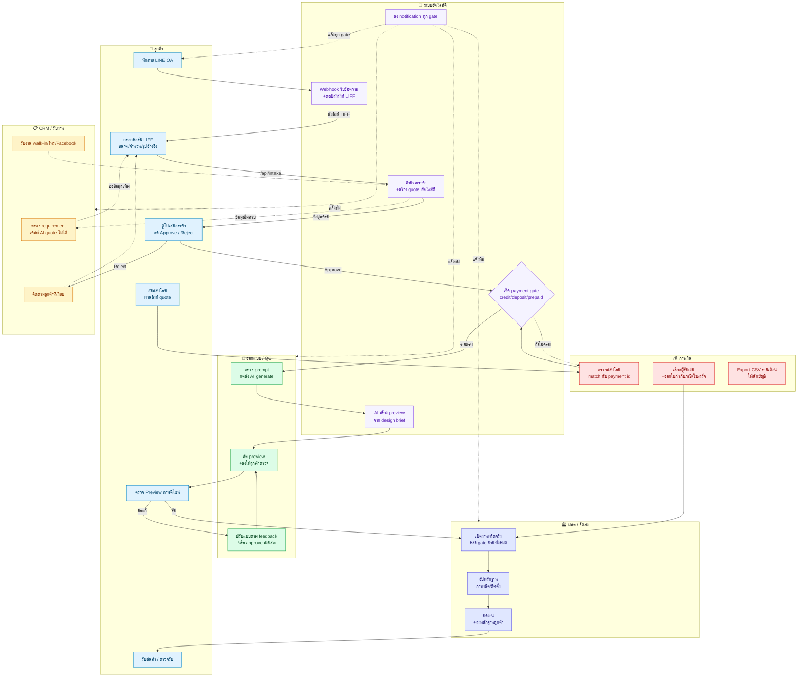
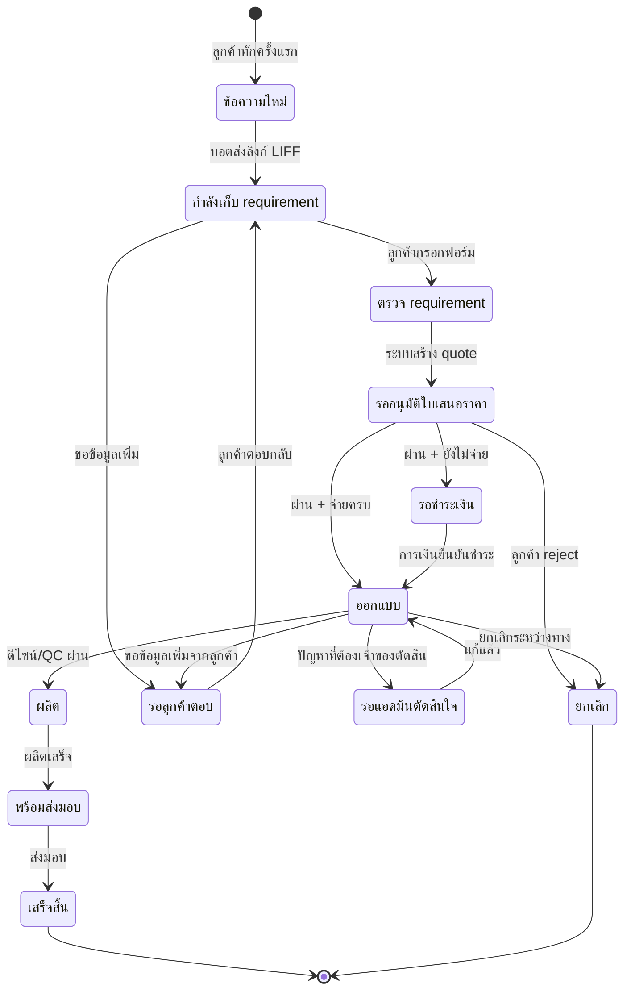
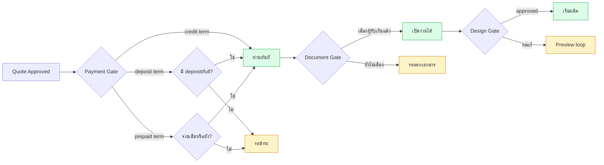

# FOGUS — ภาพรวมระบบสำหรับผู้บริหาร

> ระบบ ERP สำหรับร้านพิมพ์/ป้าย ที่รับงานผ่าน LINE Official Account
> ครบ end-to-end ตั้งแต่ลูกค้าทักแชต → ปิดงาน

---

## 1. แผนผังโฟลว์ทั้งระบบ



---

## 2. State Machine — 12 สถานะหลัก



---

## 3. ความเป็นเจ้าของแต่ละขั้นตอน

| ขั้นตอน | เจ้าของ | ทำอะไร | ระบบช่วยอย่างไร |
|---|---|---|---|
| รับข้อความ | 🤖 ระบบ | ตอบอัตโนมัติพร้อมลิงก์ฟอร์ม | 100% auto |
| เก็บ requirement | 👤 ลูกค้า | กรอกฟอร์มผ่าน LINE | LIFF mini-app |
| สร้างใบเสนอราคา | 🤖 ระบบ | คำนวณราคา + ส่ง quote ลิงก์ | 100% auto (ถ้าข้อมูลครบ) |
| ตรวจ requirement ที่ไม่ครบ | 📋 CRM | ติดตามขอข้อมูลเพิ่ม | คิวอัตโนมัติ |
| อนุมัติใบเสนอราคา | 👤 ลูกค้า | กดผ่านลิงก์ quote | 100% self-service |
| ตรวจสลิป + match payment | 💰 การเงิน | ดูสลิป + ใส่ payment id | manual แต่มี slip queue auto |
| ออกใบกำกับภาษี/ใบเสร็จ | 💰 การเงิน | เลือกผู้รับเงิน + ออกเอกสาร | runtime document gen |
| ตรวจ prompt + สั่ง AI | 🎨 ออกแบบ | กด generate, retry | AI integration |
| คัด preview + ส่งลูกค้า | 🎨 ออกแบบ | เลือกภาพ + push ผ่าน LINE | auto LINE push |
| ตอบ feedback แบบ | 👤 ลูกค้า | ดูผ่าน status link + กด | 100% self-service |
| เปิดงานผลิต | 🏭 ผลิต | ยืนยันรายละเอียดผลิต | unlock อัตโนมัติเมื่อ gate ผ่านทุก gate |
| ผลิต + จัดส่ง | 🏭 ผลิต | อัปหลักฐาน + แจ้งลูกค้า | auto notification |

---

## 4. Gate สำคัญที่ระบบบังคับ



**สาระสำคัญ:** ลูกค้า approve quote แล้วไม่ได้แปลว่าเข้าผลิตทันที — ต้องผ่าน Payment + Document + Design Gate ครบทั้งหมด

---

## 5. รายได้เข้าระบบ — เมื่อไหร่บ้าง

| Trigger | จุดที่เกิดรายได้ | เอกสารที่ออก |
|---|---|---|
| ลูกค้า approve quote (credit) | บันทึก AR ทันที | quote → invoice |
| ลูกค้าโอน deposit | บันทึก partial payment | quote + ใบเสร็จมัดจำ |
| ลูกค้าโอนเต็ม (prepaid) | บันทึก full payment | quote + ใบเสร็จ/ใบกำกับภาษี |
| ปิดงาน | confirm รายได้ครบ | ใบกำกับภาษี/ใบเสร็จงวดสุดท้าย |

---

## 6. หน้า Admin หลัก (ทีมหลังบ้านใช้)

| URL | ใครใช้ | หน้าที่ |
|---|---|---|
| `/admin` | ทุกทีม | CRM inbox — ดูคิวงานทุกระดับ + filter ตาม owner |
| `/admin/manual-intake` | CRM | รับงาน walk-in / โทร / Facebook |
| `/admin/customers` | ทุกทีม | ดูประวัติลูกค้า + Customer 360 |
| `/admin/accounting` | การเงิน | ตรวจคิวรับชำระ + ออกเอกสาร + export CSV |
| `/admin/prompts` | ออกแบบ | จัดการ prompt + สั่ง AI + ส่ง preview |
| `/admin/follow-up` | CRM | ติดตามลูกค้าที่เงียบเกินกำหนด |
| `/admin/settings` | เจ้าของ | ตั้งค่า LINE/LIFF + business rules runtime |

---

## 7. หน้าลูกค้า (public, ไม่ต้อง login)

| URL | จุดใช้ | สถานะที่เปิดได้ |
|---|---|---|
| `/liff/intake` | กรอกฟอร์มขอ quote | จาก LINE OA |
| `/quote/[token]` | ดูใบเสนอราคา + approve/reject + อัปสลิป | quote ทุกสถานะ |
| `/status/[token]` | ดู preview + กดยอมรับ/ขอแก้ + ดูสถานะ | หลังเปิด job |

---

## 8. UX ที่ปรับปรุงล่าสุด (Today, 6 PRs)

| PR | สิ่งที่แก้ | ผลกระทบทางธุรกิจ |
|---|---|---|
| #81 | CRM inbox — Thai labels + table view + expandable row | ทีมหลังบ้านสแกนคิวงานได้เร็วขึ้น ~3 เท่า |
| #82 | Dropdown menu portal + quote link | ปุ่ม action ไม่ถูกตัดทิ้งบน row ล่างสุด |
| #83 | หน้า accounting cleanup | การเงิน focus เฉพาะคิวที่ต้องทำจริง |
| #84 | manual-intake / customers / customer 360 | ทุกหน้า admin ภาษาไทยล้วน |
| #85 | padding ใน card | UI ดูเป็นมาตรฐาน enterprise |
| #86 | หน้า ออกแบบ · AI rebuild | ทีมออกแบบไม่ต้องเข้าใจ event/seed/snapshot |

---

## 9. จุดที่ยังเป็น Manual (Risk / Opportunity)

🔴 **ต้องคนทำ ยังไม่ auto:**
- ตรวจสลิปโอน → match กับ payment (ออกแบบ AI/OCR ได้)
- เลือกผู้รับเงินก่อนออกเอกสาร (rules-based automation ได้)
- คัด preview ที่ดีที่สุดจาก AI (กำลังศึกษา quality scoring)
- ติดตามลูกค้าเงียบ (มี follow-up queue แต่ยังต้องคนกด)

🟡 **Auto บางส่วน:**
- AI สร้าง preview (auto generate แต่ admin เลือก/ส่ง)
- LINE notification (auto ยิงแต่ template ยัง hard-coded)

🟢 **Auto เต็มที่:**
- รับข้อความ + ตอบส่งลิงก์
- คำนวณราคา + สร้าง quote
- Workflow state transitions ตาม gate
- บันทึก audit log + event tracking

---

## 10. Tech Stack สรุป

```
Frontend  → Next.js 16.2 + React 19 + Tailwind v4 + shadcn/ui
Backend   → Next.js API routes + Supabase (Postgres + RLS)
LINE      → LINE Messaging API + LIFF v2.28
Hosting   → Vercel (auto deploy from main)
AI        → ตั้งค่าผ่าน /admin/settings/ai (provider-agnostic)
```

**Workflow state machine:** กำกับโดยไฟล์เดียว `docs/workflow-policy.json` — เปลี่ยน workflow ทั้งระบบจากจุดเดียว ทีมไม่ต้องอัปเดต code หลายที่
