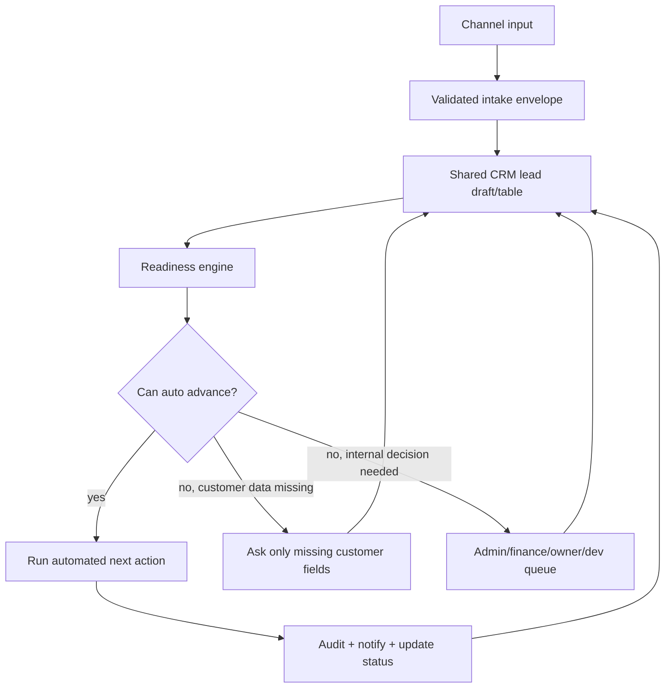

# FOGUS Automation Brainstorm v1

This is a long-form brainstorm, not an implementation freeze.

The goal is to maximize automation without making the system unsafe, confusing, or expensive to operate. Automation should reduce customer back-and-forth, reduce admin typing, and keep business policy strict. It should not hide blockers, bypass approvals, or send customers back to LIFF for problems owned by admin, finance, owner, dev, provider, or production.

Core idea:

```text
Automate when data is valid, policy is known, confidence is high, rollback/audit exists, and the next action owner is clear.
Escalate when any of those are missing.
```

## Automation Operating Principle

Automation should be built around a shared CRM lead draft/table. LINE, LIFF, admin quick-add, web forms, and future channels are input adapters. They collect or edit data, but the CRM readiness engine decides what happens next.

The system should avoid full resubmission. Every step should ask for the smallest missing delta.



## Automation Ladder

Not all automation has the same risk. Use this ladder to decide what can be automatic first.

| Level | Name | What the system can do | Risk | Example |
| --- | --- | --- | --- | --- |
| A0 | capture | store incoming data and files | low | save LINE profile, form fields, uploaded media |
| A1 | normalize | clean, dedupe, validate, classify | low | normalize phone, map product keyword to catalog |
| A2 | suggest | propose action but require staff click | medium | suggest quote price, suggested receiver entity |
| A3 | reversible auto action | auto do something that can be safely corrected | medium | assign queue, send missing-info link, mark draft incomplete |
| A4 | business auto action | auto send customer-facing or money-related action | high | send quote, payment instruction, status message |
| A5 | restricted action | never fully auto until policy and audit are mature | critical | receiver lock, tax invoice issue, refund, cancellation with payment |

Default stance:

- Start A0 to A2 everywhere.
- Use A3 for operational routing and customer delta requests.
- Use A4 only when product, price, fulfillment, payment, and document policy are explicit.
- Keep A5 behind human/owner/finance approval until the system has enough proof.

## Central Data Contract

The shared CRM lead draft should become the automation contract. Each channel writes to the same shape.

Suggested CRM draft fields:

| Group | Fields | Used for automation |
| --- | --- | --- |
| source | source_channel, source_detail, source_message_id, source_url, created_by_actor_id | dedupe, audit, resume/fresh decisions |
| identity | customer_id, line_user_id, display_name, phone, email, tax_id, company_name | customer matching and contactability |
| contact | primary_contact_method, contact_verified_at, preferred_language, latest_reply_at | follow-up automation and SLA |
| product | product_catalog_id, manual_product_name, category, pricing_model, custom_description | smart form and quote readiness |
| dimensions | width, height, area, qty, unit, material, finish, options | price calculation and production planning |
| fulfillment | mode, pickup_branch, address, map_pin, recipient, phone, site_photos, access_notes | delivery/install requirements and completion |
| document | document_request_type, billing_name, tax_id, branch_type, branch_code, billing_address | receipt/tax profile validation |
| media | uploaded_file_ids, reference_links, brief_text, ai_allowed, design_style | AI prompt, designer handoff, proof review |
| readiness | edge_validated, crm_normalized, missing_fields, blocking_reason, next_action_owner | anti-ping-pong routing |
| automation | automation_level, confidence_score, policy_version, auto_quote_allowed | decide auto vs review |
| commercial | receiver_entity_id, payment_profile_id, receiver_lock_status, credit_terms | money/document safety |
| lifecycle | workflow_state, quote_id, job_id, status_token, last_customer_action_at | status page and LINE replies |
| audit | created_at, updated_at, last_changed_by, last_change_reason | traceability |

Important rule:

```text
Do not let each screen invent its own readiness check.
Store readiness once, then let LIFF, admin, quote, payment, production, and status screens consume it.
```

## Settings Required Before Deep Automation

Automation depends more on settings than on AI. If settings are weak, AI will only move confusion faster.

| Setting area | Required decisions | Automation unlocked |
| --- | --- | --- |
| product catalog | pricing_model, required fields, active products, admin review flags | smart LIFF questions, auto quote eligibility |
| price rules | per sqm, per piece, fixed, min charge, material add-ons, rush fee | quote draft and safe auto quote |
| fulfillment rules | pickup branches, delivery area, install area, address/photo/map requirements | fulfillment validation and schedule routing |
| branch/team rules | branch owner, available staff, working hours, holidays | assignment and SLA automation |
| document rules | receipt vs tax invoice, receiver VAT capability, required customer tax fields | document readiness and customer messaging |
| payment rules | receiver to payment profile mapping, credit terms, thresholds | payment instruction and finance review |
| approval matrix | who approves quote, discount, manual price, receiver mismatch, urgent job | admin queue routing |
| AI provider rules | allowed models, quota, cost limit, fallback provider, manual mode | AI prompt routing and quota-safe design flow |
| message templates | LINE copy by workflow state and blocker type | consistent auto replies |
| escalation rules | human-support keywords, SLA, stuck-state thresholds | human review queue |
| evidence rules | payment proof, delivery proof, install proof, completion photo | closure automation |

## Channel Automation

### LINE

Automate:

- Detect returning customer by LINE user and latest active conversation.
- Choose state-specific reply instead of generic intake.
- Show one primary action per state.
- Send only the relevant deep link: resume draft, missing info, quote, payment/status, design review, production status.
- Convert free-text human-support keywords into escalation.
- Detect common customer intents: new order, ask price, send proof, ask status, approve, reject, rescope, complain, request invoice.

Do not fully automate:

- Promising delivery date when fulfillment mode/site risk is unresolved.
- Giving payment instructions when receiver/payment mapping is unsafe.
- Treating new photos as final design approval without explicit customer action.

### LIFF

Automate:

- Prefill identity and known contact data.
- Resume draft instead of starting over.
- Open only missing section when CRM says customer-owned data is missing.
- Hide irrelevant sections based on catalog and fulfillment mode.
- Validate tax profile only when tax invoice is requested.
- Convert uploads into design/media records tied to the CRM draft.
- Show progress as readiness, not as generic steps.

Do not fully automate:

- Asking every possible question just in case.
- Showing admin/internal blockers to the customer.
- Creating a new duplicate lead when the customer is only correcting old data.

### Admin Manual Add

Automate:

- Quick-add customer with minimal fields.
- Search/dedupe by phone, LINE, email, tax id, company name.
- Auto-create customer, conversation, and lead draft together.
- Suggest catalog match from free text.
- Suggest missing fields and next action owner.
- Generate focused customer follow-up link.
- Save incomplete draft safely with readiness chips.

Do not fully automate:

- Overwriting customer identity without staff confirmation.
- Merging customers when evidence is weak.
- Marking quote-ready if staff entered vague product text.

## CRM Readiness Engine

The readiness engine should return a compact decision object, not scattered booleans.

Suggested output:

```json
{
  "status": "admin_review_required",
  "confidence": 0.72,
  "missing_fields": ["install.site_photos", "install.map_pin"],
  "blocking_reason": "install_site_risk_incomplete",
  "next_action_owner": "customer",
  "allowed_actions": ["request_missing_install_info", "admin_edit_draft"],
  "blocked_actions": ["auto_send_quote", "create_job"],
  "policy_version": "workflow-policy-2026-05-03"
}
```

Readiness states:

| State | Meaning | Next action |
| --- | --- | --- |
| draft_created | row exists but not enough to route | admin/customer continue intake |
| edge_validated | source payload is structurally valid | CRM normalize |
| crm_normalized | customer/lead/conversation are joined | readiness check |
| customer_info_missing | only customer-owned fields are missing | send focused LIFF/web/admin-assisted request |
| admin_review_required | product, pricing, catalog, site risk, or manual decision needed | admin queue |
| quote_ready | enough data for quote draft or auto quote | quote create/send |
| commercial_review_required | receiver, payment, document, or credit safety unresolved | finance/owner |
| production_ready | quote/payment/document gates allow job start | production queue |
| fulfillment_ready | job done and fulfillment evidence path known | pickup/delivery/install flow |
| completed_ready | fulfillment, evidence, and document path are resolved | close job |

## Product And Quote Automation

### Catalog-Driven Smart Intake

Catalog should control questions and auto quote safety.

Automate:

- Choose required fields based on product.
- Hide size fields for fixed-price products.
- Require qty for piece-based products.
- Require address/map/photo only for fulfillment modes that need them.
- Mark manual/custom products as admin review.
- Compute area and min charge.
- Apply rush fee, material add-on, finish add-on, and branch-specific rules when settings exist.

Need human review:

- Product is not matched to catalog.
- Manual pricing model.
- Special material, unknown finish, unclear dimensions, unusual deadline.
- Install with incomplete site risk.
- Discount, override, or B2B special price.

### Auto Quote Eligibility

Use green/amber/red classification.

| Zone | Condition | Action |
| --- | --- | --- |
| green | catalog product, pricing rule, required fields, fulfillment, and customer contact are valid | auto create and optionally auto send quote |
| amber | mostly valid but manual check is useful | create quote draft, admin approves send |
| red | missing policy, manual product, receiver risk, site risk, or unclear pricing | block auto quote and route review |

Auto quote should include:

- Price snapshot.
- Product snapshot.
- Customer request snapshot.
- Fulfillment snapshot.
- Payment profile candidate, but not final unsafe payment instruction if receiver mapping is not settled.
- Policy version.

## Payment And Commercial Automation

The commercial invariant stays strict:

```text
Money receiver -> document issuer.
```

Automate:

- Select payment profile candidate from settings.
- Validate that payment profile maps to a commercial receiver entity.
- Show finance/admin warning when receiver mapping is incomplete.
- Generate customer-facing payment instruction only when safe.
- Parse payment proof metadata and attach it to quote/order.
- Create payment confirmation draft for admin/finance review.
- Lock receiver after confirmed payment.
- Trigger required document issue after payment or approved credit policy.

Human/finance/owner approval required:

- Receiver/payment profile mismatch.
- Customer requests tax invoice but selected receiver cannot issue tax invoice.
- Payment proof ambiguous or partial.
- Overpayment, underpayment, refund, split payment.
- Credit terms outside configured policy.
- Receiver change after payment request was sent.

Commercial auto actions should be conservative. Wrong money/document automation is worse than slow manual review.

## Document Automation

Automate:

- Capture document request at intake.
- Validate customer tax profile fields.
- Wait for receiver eligibility before promising tax invoice.
- Generate document draft from locked receiver, customer snapshot, quote/order snapshot, and payment snapshot.
- Generate receipt or tax invoice/receipt number after approval/issue rules pass.
- Write immutable document snapshot.
- Show document status on customer status page.

Do not fully automate yet:

- Issuing tax invoice when receiver VAT capability is uncertain.
- Editing issued document snapshots.
- Changing receiver after payment confirmation.

## AI And Design Automation

AI should accelerate design preparation, not become the legal/business actor.

Automate:

- Build structured design brief from CRM draft, product, dimensions, fulfillment, media, and customer notes.
- Generate prompt variants by product type and style.
- Route to model/provider based on settings, cost, quota, and required output.
- Fall back to manual design queue when provider quota is low or request is too complex.
- Store generated prompt, model, provider, cost estimate, output references, and staff decision.
- Show admin a preview queue: use, revise prompt, regenerate, send to designer, request customer clarification.

Human/design approval required:

- Customer supplied brand/logo with unclear usage.
- Text spelling, phone number, legal name, or address appears in artwork.
- AI output has incorrect dimensions, wrong language, wrong product, or bad typography.
- Large/signage/install job where production risk is high.
- Model quota/cost exceeds setting.

AI provider setting ideas:

| Setting | Why |
| --- | --- |
| default_provider | normal route for generated design/prompt |
| fallback_provider | keep operation moving if quota is exhausted |
| max_cost_per_draft | prevent runaway generation |
| daily_quota_warning | owner/dev knows before work stops |
| allowed_product_types | avoid using AI where output is unsafe |
| require_human_approval | force approval for customer-facing artifacts |

## Production Automation

Automate after quote/payment/commercial gates pass:

- Create job from quote snapshot.
- Create production checklist from product catalog.
- Compute material estimate.
- Assign branch/team based on product, fulfillment, and workload.
- Create due date suggestion from SLA, production time, and customer preferred date.
- Notify production queue.
- Generate internal work order.
- Request missing production media only when customer-owned.
- Move status page timeline as job events happen.

Human review required:

- Custom material or special install.
- Unclear artwork approval.
- Rush deadline outside SLA.
- Material stock conflict.
- Production blocker not owned by customer.

## Fulfillment Automation

Automate:

- Pickup: choose branch, pickup window, pickup contact, ready notification, pickup evidence.
- Delivery: validate address, map pin, recipient, phone, delivery note, route/fee candidate.
- Install: require site contact, map pin, photos, access notes, preferred window, site-risk checklist.
- Show fulfillment readiness before job completion.
- Trigger customer notification when ready for pickup/delivery/install.
- Capture evidence before completion.

Human review required:

- Install risk unclear.
- Address outside service area.
- Customer wants exact promise before schedule is confirmed.
- Delivery/installation failed or evidence missing.

## Notification Automation

Every workflow state should map to a safe message.

Automate notifications for:

- Intake received.
- Missing customer data.
- Quote sent.
- Quote approved/rejected/rescope.
- Payment instruction ready.
- Payment proof received.
- Payment confirmed.
- Document issued or pending review.
- Design proof ready.
- Design approved/revision requested.
- Production started.
- Ready for fulfillment.
- Completion and aftercare.

Message rules:

- One primary action.
- No internal blocker details.
- No promise beyond current policy state.
- If customer action is not required, do not ask them to open LIFF.
- Link to status page when passive tracking is enough.

## Admin UI Automation

The admin CRM table should show automation state clearly.

Recommended columns/chips:

| Column/chip | Purpose |
| --- | --- |
| source | LINE, LIFF, admin, web, phone, walk-in, B2B |
| customer | customer identity and contact method |
| request summary | product and key dimensions |
| readiness | missing, review, quote ready, commercial review, production ready |
| next owner | customer, admin, finance, owner, dev, system, external_provider |
| blocker | compact reason such as missing address or receiver mismatch |
| age/SLA | aging and urgency |
| next action | one-click allowed action |
| audit | latest actor/change |

One-click admin actions:

- Send missing info link.
- Edit draft.
- Match product catalog.
- Create quote draft.
- Approve/send quote.
- Assign review owner.
- Select receiver entity.
- Confirm payment.
- Issue required document.
- Create production job.
- Request customer design approval.
- Mark fulfillment evidence.

Each action should be allowed or blocked by policy, not by UI guesswork.

## Human Approval Matrix

| Area | Can auto? | Human approval when |
| --- | --- | --- |
| customer dedupe | suggest first | weak identity match or tax/company conflict |
| product match | auto for exact catalog | free text, unknown material, multiple possible products |
| quote price | auto for green zone | manual pricing, discount, B2B special terms |
| payment instruction | auto if receiver mapping safe | mismatch, split/partial payment, high value threshold |
| receiver lock | after confirmed payment rule | any receiver ambiguity |
| receipt | auto draft/issue when safe | payment ambiguity or customer data conflict |
| tax invoice | strict gate | receiver VAT capability or tax profile uncertainty |
| AI design draft | auto generate if quota/policy allows | customer-facing send, brand/legal text, expensive generation |
| production start | auto when gates pass | rush, custom install, missing approval |
| completion | auto only with evidence | missing delivery/install/document evidence |

## Anti-Ping-Pong Patterns

Use these to stop repeated customer/admin loops.

- Store raw answers and validation results together.
- Ask deltas, not full forms.
- Use section-specific links.
- Keep blocker owner explicit.
- Never send customer to LIFF for internal policy blockers.
- Keep admin edits on the same draft row.
- Recompute readiness after every write.
- Persist policy version for every automated decision.
- Show exactly why an action is blocked.
- Let status page show progress without requiring action.

## Automation Roadmap Brainstorm

### Phase 1: Make CRM Draft The Center

- Define shared CRM draft/table contract.
- Normalize LIFF/admin/web into the same contract.
- Store readiness result and next action owner.
- Add admin quick-add and edit draft UX.
- Add one-click missing-info request.

### Phase 2: Catalog-Driven Intake

- Extend product catalog contract.
- Drive LIFF/admin fields from catalog.
- Add auto quote green/amber/red classification.
- Add admin review queue for amber/red.

### Phase 3: Commercial Safety Automation

- Require payment profile to receiver mapping.
- Show commercial readiness before payment instruction.
- Add receiver lock on confirmed payment.
- Draft required receipt/tax document from locked receiver.

### Phase 4: AI Prompt And Design Assist

- Generate design brief from CRM data.
- Route provider/model by setting and quota.
- Store prompt/output/audit.
- Require human approval for customer-facing design.

### Phase 5: Production And Fulfillment Automation

- Create production job from quote snapshot.
- Generate work order/checklist.
- Add fulfillment-specific readiness and evidence.
- Complete only when fulfillment/document/evidence path is resolved.

## Final Brainstorm Rule

Maximum automation does not mean every action is automatic. It means the system always knows the next smallest safe action.

```text
If data is missing, ask the right person for only that data.
If policy is missing, send it to the owner/admin/dev queue.
If confidence is high and audit exists, auto advance.
If money, document, legal, or production risk is high, require approval.
```
