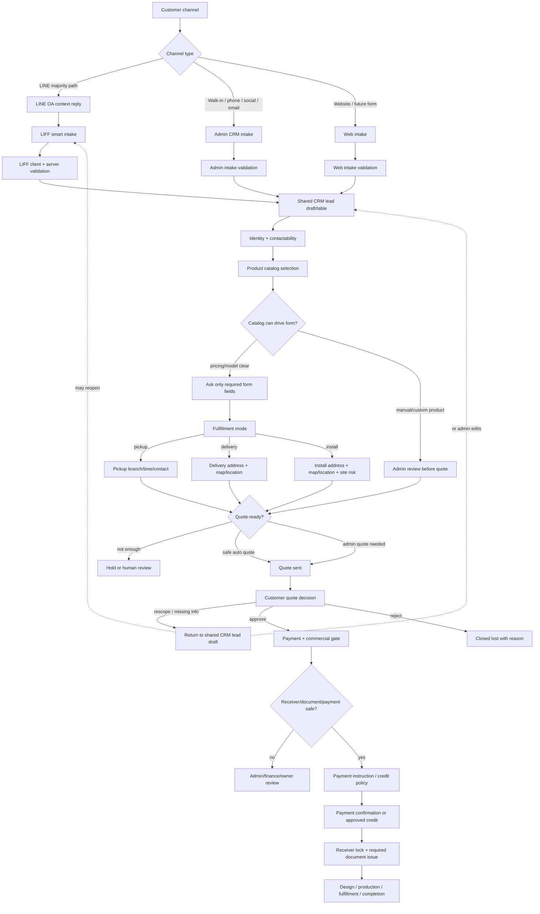
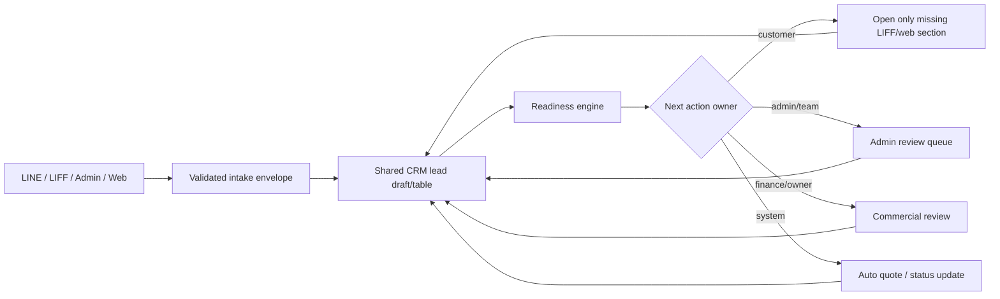

# FOGUS Reality Analysis Map v1

This is not the final operating-flow freeze.

This document maps what the system actually does today, where policy must be strict, and which UI rules should be locked before the next coding round. The goal is to stop rebuilding from vague intent. Each future implementation slice should start from this map, then update it when reality changes.

## Source Hierarchy For This Analysis

| Layer | Source | How to treat it |
| --- | --- | --- |
| Runtime state truth | `docs/workflow-policy.json`, `src/lib/workflow-transitions.ts`, `src/lib/workflow-policy-core.mjs` | Canonical for current state/CTA rules |
| LINE entry truth | `src/app/api/webhook/route.ts`, `src/lib/line.ts` | Canonical for returning customer behavior |
| LIFF intake truth | `src/app/liff/intake/intake-form.tsx`, `src/app/api/intake/route.ts` | Canonical for customer form, validation, quote creation |
| Quote/status truth | `src/app/quote/[token]/page.tsx`, `src/app/status/[token]/page.tsx`, `src/app/api/quotes/public/[token]/route.ts` | Canonical for public customer actions |
| Admin operating truth | `src/app/admin/page.tsx`, `src/lib/admin-overview.ts`, `src/lib/backoffice-automation.ts`, `src/app/admin/quote-actions.tsx` | Canonical for current backoffice operations |
| Commercial rule truth | `docs/COMMERCIAL_DOCUMENT_POLICY_V1.md`, `docs/COMMERCIAL_DOCUMENT_BUSINESS_FLOW_V1_FREEZE.md` | Canonical for receiver/document policy |
| Future ideas | `src/app/liff/intake/End-to-End.md` | Useful ideas only; not runtime truth |
| Demo shell | `src/app/dashboard/page.tsx`, `src/app/dashboard/data.json` | Not operating truth; should not drive workflow decisions |

## Reality Summary

The system already has a strong workflow spine, but the UI is not fully locked around that spine.

Current reality:

- LINE can route returning customers by conversation state.
- LIFF can verify identity, collect structured order data, validate tax/document fields, create lead, calculate price, create quote, and push quote link.
- Public quote page can approve/reject/rescope and show payment instructions from a payment profile snapshot.
- Status page can show job/design state and let customers resolve hold, approve design, or request revision.
- Admin page has a real overview queue, automation counters, and quote/payment/receiver actions.
- `/dashboard` is still demo-style UI and should not be used as the operating command center.

Main risk:

```text
System can move fast from LIFF -> quote -> payment instructions,
but payment receiver, commercial document rules, and admin UI gates are not yet strict enough
to guarantee every customer sees the right next action and every operator sees the right blocker.
```

## Actual Flow Map

### 1. LINE Entry And Re-Entry

Actual behavior:

| Customer situation | Current system behavior | Reality status |
| --- | --- | --- |
| New text message, no reusable conversation | Creates conversation and replies with LIFF intake link | Working |
| Existing early conversation | Offers resume or fresh intake | Working |
| `WAITING_QUOTE_APPROVAL` | Sends quote context/link, not generic resume | Working |
| `WAITING_PAYMENT` | Sends payment/status context, not generic resume | Working |
| `IN_DESIGN`, `IN_PRODUCTION`, `READY_FOR_FULFILLMENT` | Sends production/status context | Working |
| `COMPLETED` or `CANCELLED` | Sends fresh intake invitation | Working |
| Customer types human-support keywords | Creates escalation and moves to `HUMAN_REVIEW_REQUIRED` | Working |

Strict policy needed:

- LINE must never show a generic intake CTA when the customer is waiting on quote, payment, design response, production, or fulfillment.
- LINE must keep one primary action per state.
- LINE copy should be state-specific and should not expose internal errors.

UI issue to lock:

- Flex message styling/copy should become a reusable contract. Right now each reply type manually defines copy, color, button labels, and icons.
- Quote-waiting reply includes a fresh-intake button. That can be useful, but it is risky because it allows customer to branch away while a quote is active. It should be governed by explicit policy: fresh intake is secondary, visually quieter, and must not look like the main path.

### 2. LIFF Entry

Actual behavior:

- `/liff` redirects to `/liff/intake` and preserves query hints like category/product/mode/devNoLiff/lineUserId.
- `/liff/intake` loads runtime app config and disables LIFF only for local/dev test conditions.
- Customer identity is required in production through LIFF ID token.
- Access token enrichment is best-effort and logs incidents if enrichment fails.

Strict policy needed:

- Production intake must require verified LINE identity.
- Dev bypass must stay development-only.
- LIFF identity failure should block submit, not create anonymous customer records.

UI issue to lock:

- Intake should show an explicit identity readiness state before submit: ready, reconnect from LINE, or local test mode.
- Error copy should tell the customer the next action, not just that identity failed.

### 3. LIFF Form Reality

Actual collected groups:

| Group | Current fields |
| --- | --- |
| Work basics | product type, width, height, unit, quantity, due date |
| Contact | phone, LINE user ID/display name from LIFF |
| Fulfillment | pickup/delivery/install, address fields, optional latitude/longitude |
| Document intent | requested document type, billing entity type, branch type/code, billing name, tax ID, billing address |
| Design context | design brief, note, reference info, reference files |
| Runtime metadata | intake mode, LIFF access token, LIFF context snapshot |

Client validation currently blocks:

- no product type
- non-positive width/height
- no phone
- no due date or past due date
- no fulfillment mode
- incomplete delivery/install address
- incomplete latitude/longitude pair
- non-numeric latitude/longitude
- tax invoice missing billing name/tax ID/address/branch code when needed
- missing LIFF ID token in configured LIFF mode

Server validation additionally blocks:

- invalid JSON/form payload
- invalid payment terms, billing type, document type, intake mode
- invalid customer media files
- invalid LIFF token
- invalid fulfillment geolocation bounds
- incomplete tax invoice details

Reality status:

- Form validation is stronger than before.
- The form can still create a quote immediately if data is complete.
- Reference upload failure is non-blocking: lead/quote survives and customer receives warning.

Strict policy needed:

- LIFF form is not just an inquiry form; it is quote-triggering input.
- Any field that affects quote total, document identity, payment routing, or fulfillment cost must be explicit and reviewable.
- Tax invoice request only validates customer profile data today; it does not by itself guarantee the receiver can issue VAT documents.

UI issue to lock:

- Keep progressive disclosure, but each collapsed section must show a reliable summary chip.
- Required fields must be visible before submit when their condition is selected.
- Tax/document section should show: customer request is captured, final eligibility depends on receiver chosen by admin.
- Fulfillment mode should visibly affect required address/location fields.

### 4. Intake Submit To Quote Creation

Actual behavior:

```text
LIFF submit
-> verify identity
-> upsert customer
-> reuse or create conversation
-> optional fresh restart cancels/supersedes old work
-> create lead
-> upload media if present
-> if incomplete, move to ON_HOLD_CUSTOMER_INPUT
-> if complete, calculate price
-> resolve payment profile snapshot
-> create quote status=sent
-> create quote item
-> set conversation WAITING_QUOTE_APPROVAL
-> push quote link via LINE
```

Reality status:

- This is already a semi-automated sales flow.
- Pricing can come from product catalog or fallback calculator.
- Payment profile is selected at quote creation from settings using total, billing entity type, and payment terms.

Strict policy needed:

- Auto-quote is only safe for products/pricing rules the business trusts.
- If product/pricing is uncertain, quote should become admin review, not auto-sent.
- Payment profile snapshot is not the same as commercial receiver lock.

UI issue to lock:

- Customer submit success should clearly say whether quote was sent or staff review is needed.
- Admin queue should show whether a lead was auto-quoted or parked for review.
- Quote page should display why a payment profile was selected, but not imply commercial document eligibility is settled.

### 5. Public Quote Page Reality

Actual behavior:

- Displays bill-to data from lead/customer.
- Displays requested document type and tax ID if captured.
- Shows quote items, VAT, total, payment terms/status.
- Shows payment instructions from payment profile snapshot or current config fallback.
- Allows approve/reject/rescope depending on quote/job/payment state.
- If approved but payment still gates work, allows rescope but not approve again.

Reality status:

- Customer actions are reasonably policy-driven.
- Payment instructions can appear on quote page based on payment profile readiness.
- Commercial receiver policy is not yet customer-visible on quote page.

Strict policy needed:

- Quote page must not show payment instructions that conflict with receiver/document policy.
- Approval CTA must disappear after payment gate begins.
- Rescope should be allowed only while no job exists.
- Rejection should be blocked after job exists.

UI issue to lock:

- Payment panel must show the next customer action, not all possible accounting context.
- If receiver/document eligibility is missing, quote should direct customer to wait for admin payment instruction instead of showing risky account details.

### 6. Payment Routing Reality

Current payment routing supports:

- primary payment profile
- secondary payment profile
- secondary selection by total threshold
- secondary selection by customer type: person/company/all
- secondary selection by payment term: prepaid/deposit/credit/non-credit/all
- fallback to secondary when primary is missing

Reality gap:

```text
Payment profile routing chooses account display data,
but commercial policy needs receiver entity identity.
Those are related but not yet the same model.
```

Strict policy needed:

- Every payment profile/channel must map to a commercial receiver entity before fully automatic payment instructions are safe.
- If customer requests tax invoice, payment channel must map to a VAT-capable receiver.
- The invariant is: money receiver = document issuer.

UI issue to lock:

- Settings should not present payment profile configuration as complete unless receiver mapping is complete.
- Admin quote action should show receiver status before payment capture.
- Customer quote/payment panel should hide or soften account details when receiver is not safe.

### 7. Admin Operating Reality

Actual `/admin` behavior:

- Fetches runtime config, backoffice snapshot, automation snapshot, and overview page.
- Shows summary counts: system-managed, auto-flowing, needs human now, waiting on customer.
- Overview rows cover escalations, blocked conversations, waiting customer, quote, production review, and running job.
- Quote actions include payment term/status changes, deposit/paid capture, receiver selection, rescope, reject.

Actual `/dashboard` behavior:

- Uses demo components and `data.json`.
- It is not the operating truth.

Strict policy needed:

- Development should treat `/admin` as the backoffice operating surface.
- `/dashboard` should be renamed/removed/repositioned later, or made intentionally non-operational, to avoid duplicate admin concepts.

UI issue to lock:

- Admin UI must be queue-first, not chart-first.
- Each row should answer: what is the blocker, who owns it, what action is safe now.
- Actions should be blocked with reasons, not merely hidden.

### 8. Status Page Reality

Actual behavior:

- Status page resolves by quote public token.
- If quote is still sent, status page links back to quote approval.
- Shows current job status, fulfillment-aware labels, tracking code, job details, price, latest notes, design status/images, customer actions, and timeline.
- Customer can resolve hold, approve design, or request revision only when the current state allows it.

Reality gap:

- If no job exists yet, status display can be less meaningful because it is job-driven.
- Payment/commercial document state is not fully represented as a first-class status page step.

Strict policy needed:

- Status page must not look empty or confused before job exists.
- Payment confirmation and document issue should become visible steps once commercial gating is enforced.

UI issue to lock:

- Status page should be state-machine driven, not just job-driven.
- Timeline should include quote/payment/document milestones, not only job timeline.

## Connected Flow Spine

The reality map should now be read as one connected operating spine, not as separate LINE, LIFF, catalog, payment, and production topics.



Read the diagram this way:

- LINE is the default customer path, but not the only CRM path.
- LIFF is a smart intake surface, not the whole CRM.
- Admin CRM intake and future web intake must normalize into the same lead draft shape as LIFF.
- Product catalog drives which fields LIFF should ask and whether auto quote is safe.
- Fulfillment mode changes required fields before quote readiness.
- Payment/commercial gate is after quote approval, but its risk starts at catalog, tax request, payment profile, and receiver mapping.

## Validated Intake Envelope

The system should not wait until quote/payment/production to discover that basic intake data is unusable. Each channel should send a validated envelope into the shared CRM lead draft, then CRM becomes the place that computes readiness, missing fields, ownership, and next action.

Strict rule:

```text
Channel forms validate shape and customer-owned fields.
CRM validates normalized business readiness and decides who owns the next action.
```

What should already pass validation before CRM processing:

| Data group | Edge validation before CRM | CRM processing after intake | If not valid |
| --- | --- | --- | --- |
| channel identity | LIFF token, LINE user id, admin actor, or web session/source marker exists | dedupe customer, attach conversation, choose resume/fresh path | block anonymous production intake or mark manual source review |
| contactability | name plus reachable phone/LINE/email according to channel | choose primary contact method and escalation path | ask customer only for missing contact field |
| product intent | selected catalog item or manual/custom description exists | map to catalog policy, pricing model, auto-quote safety | admin catalog review if product is unclear |
| quantity/size/pricing inputs | required numeric fields for selected product are present and sane | compute draft price inputs, mark quote-ready or needs review | ask only missing work fields |
| fulfillment mode | pickup/delivery/install selected when required by catalog | compute required fulfillment fields and operational risk | reopen only fulfillment section if customer-owned |
| delivery/install location | address/contact/map pin/photos when required by mode | route delivery/install risk, schedule, and completion checklist | customer task for missing address/photos; admin review for site risk |
| document/tax request | tax invoice fields validated when requested | store request, then defer eligibility to receiver/payment gate | customer task for missing tax profile only |
| media/design brief | uploaded files and brief metadata are attached or explicitly skipped | assign design readiness, AI prompt readiness, or manual design path | customer task only when brief/media is actually needed |
| consent/audit source | submission source, timestamp, and actor are known | write audit/action log and prevent silent mutation | block or manual review |

The important detail is that CRM should store both the raw customer answer and the validation result. Downstream screens should read `missing_fields`, `blocking_reason`, and `next_action_owner` from the shared lead/quote state instead of guessing from the original LIFF form again.

Useful readiness labels:

| Label | Meaning | Owner |
| --- | --- | --- |
| `edge_validated` | Channel payload is shaped enough to enter CRM | source channel |
| `crm_normalized` | Customer, lead, conversation, and product intent are joined | CRM |
| `customer_info_missing` | Only customer-owned fields are missing | customer via LIFF/web/admin-assisted intake |
| `admin_review_required` | Business/catalog/pricing/site risk needs staff decision | admin/team |
| `quote_ready` | CRM has enough validated inputs to create or send quote | system/admin |
| `commercial_review_required` | Payment receiver/document/credit safety is not settled | finance/owner |

## Central CRM Processing To Reduce Round Trips

The way to reduce data ping-pong is to treat LINE, LIFF, admin intake, and future web forms as input adapters only. They should all write into one CRM lead draft contract. After that, the workflow engine decides whether to auto-advance, ask customer for a small delta, or assign staff review.



Practical anti-ping-pong rules:

- CRM should ask for deltas, not full resubmission.
- LIFF should reopen only the section that owns the missing customer data.
- Admin CRM intake should edit the same draft, not create a parallel copy of the lead.
- Quote, payment, design, production, and status screens should consume CRM readiness results, not re-validate channel payloads independently.
- Every blocker should have an owner: `customer`, `admin`, `finance`, `owner`, `dev`, `system`, or `external_provider`.
- If the owner is not `customer`, do not send the customer back to LIFF.

This makes the CRM the central processor while keeping each customer touchpoint light. The customer should feel like the system remembers previous answers, and staff should see exactly which small missing piece blocks the next step.

## CRM Table And Manual Admin Add

The validated intake envelope should land in a table-backed CRM draft. In current system terms, this can start from the existing customer, conversation, lead, quote, job, action log, and escalation data rather than a separate CRM product.

Strict rule:

```text
Admin manual add is another intake adapter.
It must write the same CRM draft contract as LIFF, with source, actor, validation result, and next action owner.
```

Suggested table-backed ownership:

| CRM data | Primary purpose | Likely source | Notes |
| --- | --- | --- | --- |
| customer identity | who the customer is | LIFF, LINE, admin manual, web | dedupe by LINE id, phone, email, tax id where safe |
| conversation/channel | how the customer can be contacted | LINE webhook, admin manual, web | keeps resume/fresh flow and latest context |
| lead draft | what the customer wants now | LIFF, admin manual, web | main CRM work item before quote/job |
| validation result | what is complete or missing | channel validation + CRM readiness engine | store `missing_fields`, `blocking_reason`, `next_action_owner` |
| product intent | selected catalog/manual product | LIFF picker or admin manual selector | drives required fields and auto-quote safety |
| fulfillment intent | pickup/delivery/install details | LIFF or admin manual | controls address/location/site-risk requirements |
| document request | receipt/tax invoice request | LIFF or admin manual | customer request only; final eligibility waits for commercial gate |
| quote/commercial link | quote and payment path | system/admin | created after lead is quote-ready or reviewed |
| audit/action log | who changed what | all channels/admin actions | required for manual edits and approval decisions |

Manual admin add should be easy because it is progressive, not because it bypasses rules.

Minimum quick-add fields:

| Field | Required at quick add? | Why |
| --- | --- | --- |
| customer name or display name | yes | creates a usable CRM row |
| contact method | yes | staff can follow up without hunting chat history |
| source channel | yes | separates walk-in, phone, social, email, B2B, LINE-assisted |
| product intent or free-text request | yes | CRM can route catalog/manual review |
| fulfillment mode | if known | prevents asking address for pickup and missing site data for install |
| notes | optional but visible | captures human context from phone/walk-in |

Expandable admin sections should mirror LIFF sections:

- Product and pricing inputs.
- Fulfillment and location.
- Document/tax request.
- Media/design brief.
- Quote notes and admin review reason.

Admin UX rules:

- Quick add can save an incomplete draft.
- The table row must show readiness chips such as `customer_info_missing`, `admin_review_required`, `quote_ready`, and `commercial_review_required`.
- Admin should be able to edit the same draft without creating a duplicate lead.
- If only customer-owned data is missing, admin can send a focused LIFF/web section link.
- If the missing data is catalog/payment/receiver/AI/production policy, the row stays in staff/owner/dev queue instead of sending the customer back to LIFF.
- Manual edits must write audit events with admin actor and reason when they affect quote, payment, document, or production readiness.

This is the clean operating model: every customer request becomes one CRM table row/draft, no matter whether it came from LIFF or an admin typing it in after a call.

## Product Catalog To LIFF Decision Chain

Current catalog import supports CSV with product identity, category, customer label, keywords, `per_sqm`, `min_charge`, active status, and sort order. That is enough for simple area-based auto quote, but not enough for a full smart form.

The next catalog contract should decide form behavior and automation safety:

| Catalog decision | Why LIFF needs it | Example |
| --- | --- | --- |
| `pricing_model` | Determines which price fields matter | `per_sqm`, `per_piece`, `fixed`, `manual` |
| `requires_size` | Controls whether width/height appear | vinyl requires size, logo design may not |
| `requires_qty` | Controls quantity requirement | stickers need qty |
| `requires_fulfillment` | Controls pickup/delivery/install section | some digital/design work may skip delivery |
| `requires_design_brief` | Controls design questions | custom sign, logo, mockup |
| `image_url` | Helps customer pick correctly | product picker visual |
| `allow_auto_quote` | Determines whether LIFF can create sent quote | standard vinyl yes, custom install no |
| `requires_admin_review` | Forces lead review before quote | manual install, special material |

Strict rule:

```text
Catalog does not only display products.
Catalog tells LIFF which questions to ask and tells workflow whether auto quote is safe.
```

Temporary v1 import stance:

- Google Sheet can be the business editing surface.
- CSV remains the import path until the column contract is stable.
- External `image_url` is acceptable for prototype UI, but images hosted on Facebook/LINE should not be treated as durable canonical assets.
- Product images are optional for quoting; pricing and policy fields are mandatory for automation.

## Fulfillment Decision Chain

Fulfillment must be captured before quote readiness because it affects pricing, schedule, risk, and completion.

| Mode | Required data | Quote risk | Completion meaning |
| --- | --- | --- | --- |
| pickup | pickup branch, preferred pickup date/time, pickup contact | low | customer picked up or staff marked pickup complete |
| delivery | recipient, phone, Thai address, map pin/location when possible, delivery notes | medium | delivered or delivery evidence recorded |
| install | site contact, phone, address, map pin/location, preferred time window, site photos, access notes, install constraints | high | installation completed with evidence |

Strict rule:

```text
pickup does not require address.
delivery requires contactable address.
install requires address + location + site-risk information, or human review.
```

LIFF should open only the section needed for the selected fulfillment mode. Admin CRM intake must collect the same fields when the customer is walk-in, phone, social, email, or B2B.

## LIFF Loopback Guards

Many future fixes will naturally loop back to LIFF because LIFF is where most customer data enters. That is useful, but it can cause bad design if every missing downstream rule becomes another generic form field.

Use these loopback rules:

| Downstream problem | Loop back to LIFF? | Better action |
| --- | --- | --- |
| Missing product/size/qty/date | Yes | Ask only the missing work fields |
| Missing delivery address | Yes | Reopen fulfillment section only |
| Install site risk unclear | Maybe | Ask for photos/location, then human review |
| Missing tax invoice customer data | Yes | Reopen document section only |
| Receiver/payment profile not mapped | No | Admin/settings/commercial mapping fix |
| VAT receiver mismatch | No | Admin/finance selects another receiver or blocks payment |
| AI provider quota/billing | No | Owner/dev handles provider; design goes manual |
| Product pricing model unclear | No | Catalog/admin review fix before auto quote |
| Quote rescope | Maybe | Return to shared lead draft; use LIFF only if customer must edit structured fields |
| Completion evidence missing | No | Admin/production fulfillment flow |

The core anti-loop rule:

```text
Only send customer back to LIFF when the missing information belongs to the customer.
Do not send customer back to LIFF to fix admin policy, catalog, payment, receiver, AI, or production setup.
```

This keeps LIFF easy for the LINE majority path while preventing the form from becoming a dumping ground for every unresolved backend policy decision.

## Policy Gates That Need To Be Strict

| Gate | Current reality | Required strict rule | UI implication |
| --- | --- | --- | --- |
| LINE re-entry | Mostly implemented | No generic intake CTA for mid-flow customers | One primary action per state |
| LIFF identity | Server blocks missing/invalid token in production | No anonymous production intake | Show identity readiness before submit |
| Lead source/CRM intake | LINE is strongest path, other channels are manual/future | All channels normalize into shared customer + lead draft | Admin CRM intake must match LIFF fields |
| Product catalog | CSV runtime exists with area pricing | Catalog must define smart-form and auto-quote safety | Product picker asks only fields needed by selected product |
| Auto quote | Complete form can auto-create quote | Only trusted product/pricing paths should auto-send | Admin review lane for uncertain pricing |
| Fulfillment | Pickup/delivery/install fields exist in LIFF | Mode controls required address/location/site-risk fields | No address for pickup; strict info for install |
| Tax profile | Validates customer tax fields | Tax invoice still depends on receiver VAT capability | Show request captured, eligibility pending receiver |
| Payment profile | Snapshot selected at quote creation | Profile must map to receiver entity before safe auto-pay | Settings readiness warning and quote payment guard |
| Receiver lock | Admin receiver selection exists | Receiver selected before usable payment confirmation; locked after payment | Receiver badge/action before payment capture |
| Commercial documents | Policy says receiver=document issuer | Document issue must follow locked receiver | Customer status step for receipt/tax doc |
| AI prompt | Prompt composition exists, generation is explicit | AI draft is assistive, not final business action | Show AI ready/manual fallback, not magic automation |
| Production start | Quote workflow can unlock by payment terms | Production must also respect commercial gate | Block move-to-production with exact missing prerequisites |
| Completion | Job can complete | Completion must mean fulfillment/evidence/document path is resolved | Completion checklist before close |

## UI Lock Rules For Faster Coding

These are the UI rules that should be locked before more feature work. They are intentionally practical.

### Rule 1: One Canonical Surface Per Actor

| Actor | Canonical surface |
| --- | --- |
| Customer intake | LINE + `/liff/intake` |
| Customer quote decision | `/quote/[token]` |
| Customer progress/feedback | `/status/[token]` |
| Admin/operator | `/admin` |
| Settings owner | `/admin/settings` |
| Demo/dashboard experiments | `/dashboard` only if clearly marked non-operational |

No future code should add a second surface for the same actor/task without a decision record.

### Rule 2: Every State Has One Primary CTA

| State/context | Customer primary CTA | Admin primary CTA |
| --- | --- | --- |
| New/collecting | Open LIFF intake | Review latest message/intake |
| Requirements review | Wait or provide missing info | Prepare/send quote or mark hold |
| Waiting quote approval | Approve/rescope quote | Follow up or rescope |
| Waiting payment | Send payment proof / contact admin | Confirm receiver, payment, document gate |
| In design | Approve/request design revision only when preview is sent | Generate/manual design/send preview |
| In production | View status/contact admin | Upload/review production evidence |
| Ready for fulfillment | Coordinate pickup/delivery/install | Close fulfillment package |
| Completed | Start new work if needed | Audit/history only |

Secondary actions may exist, but they must be visually quieter and never compete with the primary action.

### Rule 3: Blockers Must Be Visible With Owner

Admin rows should expose these fields conceptually:

```text
current state
blocked reason
owner: customer | admin | owner | finance | design | dev
safe next action
unsafe actions and why they are blocked
```

This prevents UI from becoming odd because every button is justified by policy.

### Rule 4: Settings Need Readiness, Not Just Inputs

Settings should show readiness groups:

- LINE ready: channel token + secret + base URL + webhook URL.
- LIFF ready: LIFF ID + base URL + valid redirect behavior.
- Payment ready: primary/secondary channel data complete.
- Commercial ready: each channel mapped to receiver entity and VAT status.
- AI ready: enabled + provider + model + key present.
- Production ready: upload/review/send settings configured.

Each group should return:

```text
ready | missing | risky
```

### Rule 5: Customer UI Must Hide Internal Complexity

Customer should not see:

- provider names unless useful to the business
- database state labels
- commercial entity internals
- stack/provider failure details
- multiple conflicting next actions

Customer should see:

- what we received
- what is waiting
- what they need to do next
- when the team owns the next step

### Rule 6: Admin UI Must Show Policy Consequences

Admin can see complexity, but it must be structured:

- receiver affects receipt/tax invoice issuer
- payment term affects unlock behavior
- AI failure affects design path but not order existence
- production start depends on quote, payment, document, and design gates

### Rule 7: Do Not Let Demo UI Become Product UI

`/dashboard` currently reads as generic analytics/demo UI. It should not influence business workflow design.

If reused later, it must either:

- become a true owner analytics surface, or
- be removed/renamed to avoid confusing it with `/admin`.

## Immediate Gaps To Fix Before Final Flow Freeze

1. Map payment profiles to commercial receiver entities.
2. Decide whether quote page can show payment instructions before receiver is selected.
3. Add a policy-level customer/admin UI contract for payment/document gate.
4. Make status page show pre-job states cleanly: quote approval, waiting payment, document issue.
5. Add settings readiness indicators.
6. Make admin overview rows show blocker owner and safe next action consistently.
7. Decide how credit-term jobs pass commercial/document gate.
8. Define AI fallback UI: not configured, quota/billing failure, provider failure, storage failure, manual design path.

## Recommended Next Coding Packets

Work should continue in small packets from reality to policy to UI:

1. Policy packet: add payment/document gate to workflow policy and UI contract.
2. Settings packet: add readiness model for LINE/LIFF/payment/commercial/AI/production.
3. Commercial mapping packet: map payment profiles/channels to receiver entities.
4. Quote UI packet: hide or guard payment instructions until receiver/document risk is resolved.
5. Admin queue packet: show blocker owner and safe next action in `/admin` rows.
6. Status UI packet: make status page state-machine driven before job exists.
7. Dashboard cleanup packet: remove or reposition `/dashboard` as non-operational.

## How To Use This Map

Before coding a workflow/UI change, answer these questions:

1. Which actor owns this step?
2. Which canonical surface should change?
3. Which workflow state or policy gate controls the CTA?
4. What is the one primary action?
5. What action must be blocked, and what reason should the UI show?
6. Does this change affect payment receiver or document issuer?
7. Does this change create AI automation, or only AI assistance?

If the answer is unclear, update this map or create a decision doc before writing feature code.
