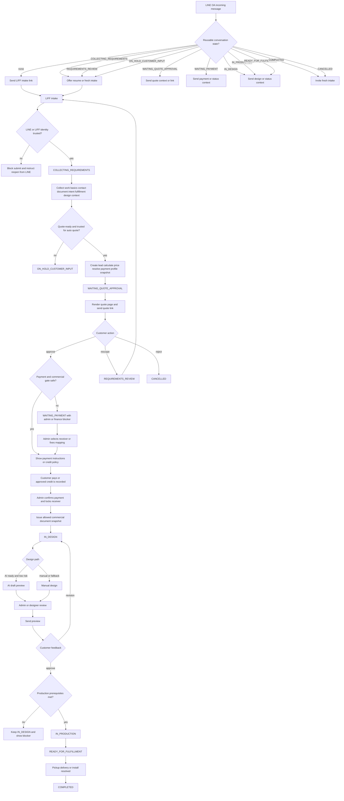
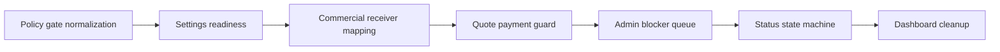

# Canonical business flow และ packetized implementation plan สำหรับ akkpol/craft-run-app

## บทสรุปผู้บริหาร

เอกสารที่เข้าถึงได้ตรงในเทิร์นนี้คือ **FOGUS Reality Analysis Map v1** ซึ่งประกาศชัดว่าเป็น **analysis baseline** ไม่ใช่ flow freeze สุดท้าย และกำหนด source hierarchy โดยวาง `docs/workflow-policy.json` ร่วมกับ `src/lib/workflow-transitions.ts` และ `src/lib/workflow-policy-core.mjs` เป็น runtime state truth; ส่วนพฤติกรรม LINE, LIFF, quote/status, admin, และ commercial policy มีไฟล์ canonical ของตัวเองแยกชัดเจน. ดังนั้น การแปลง flow ธุรกิจที่ให้มาให้ “repo-aligned” ควรเริ่มจาก **docs-first normalization** ก่อนแตะโค้ด และต้องยึด state names ให้ตรงกับ policy จริงทุกจุด. fileciteturn0file0L11-L15 fileciteturn0file0L19-L31

จาก reality map, ระบบปัจจุบันมี “workflow spine” แข็งแรงอยู่แล้ว: LINE re-entry ทำงานตาม conversation state, LIFF เก็บข้อมูลและสร้าง quote ได้, quote page รองรับ approve/reject/rescope, status page แสดงความคืบหน้าได้, และ `/admin` เป็น operating surface ที่แท้จริง ขณะที่ `/dashboard` ยังเป็น demo shell เท่านั้น. ช่องโหว่หลักยังอยู่ที่ payment receiver enforcement, commercial document safety, และ UI gate ที่ยังไม่เข้มพอจะ guarantee ว่าลูกค้าเห็น next action ที่ถูก และ operator เห็น blocker ที่ถูก. fileciteturn0file0L35-L53 fileciteturn0file0L255-L272

ข้อเสนอที่ปลอดภัยที่สุด คือทำเป็น **หนึ่ง canonical Mermaid flow + เจ็ด implementation packets** ตามลำดับจาก policy ไป UI: policy gate, settings readiness, commercial mapping, quote guard, admin blocker queue, status state machine, และ dashboard cleanup โดยยึด anti-loop rule ว่าให้ **เปิด active packet ทีละตัว** และส่งลูกค้ากลับไป LIFF เฉพาะเวลาที่ข้อมูลที่ขาดเป็น “customer-owned” เท่านั้น. fileciteturn0file0L664-L688 fileciteturn0file0L808-L829

## ฐานข้อมูลอ้างอิงและกติกาการจัดแนวกับ repo

ในเทิร์นนี้ รายงานอิงจากเอกสาร analysis baseline ที่อัปโหลดเข้ามาเป็นหลัก เพราะมันระบุ source hierarchy ของ repo ไว้ชัดอยู่แล้ว: runtime state truth คือ `docs/workflow-policy.json` และไฟล์ policy core; LINE entry truth อยู่ที่ webhook/line modules; LIFF truth อยู่ที่ intake form และ intake API; public customer path อยู่ที่ quote/status pages; admin operating truth อยู่ที่ `/admin`; ส่วน commercial policy อยู่ที่เอกสาร commercial โดยตรง. กล่าวอีกแบบคือ รายงานนี้ไม่ได้ “คิด flow ใหม่” แต่กำลัง **normalize flow เดิมให้กลับเข้ากับโครง canonical ที่เอกสารระบุไว้แล้ว**. fileciteturn0file0L19-L31

รายงานนี้ยังยึดกติกา UI/operations ที่เอกสารล็อกไว้แล้วด้วย ได้แก่ **one canonical surface per actor**, **one primary CTA per state**, **blockers must be visible with owner**, และ **settings ต้องแสดง ready / missing / risky**. นี่มีผลโดยตรงต่อการออกแบบ Mermaid flow, การแตก packet, และการกำหนด acceptance criteria เพราะมันบอกว่าปัญหาส่วนใหญ่ไม่ควรแก้ด้วยการเพิ่มหน้าหรือเพิ่ม state ใหม่แบบ ad hoc. fileciteturn0file0L714-L771

เพื่อความตรงไปตรงมา: การวิเคราะห์ collision กับเลขงาน `#11, #17, #20, #25, #33, #36, #37` ด้านล่าง ใช้ **เลขงานตามที่ผู้ใช้ระบุและหัวข้อที่ตรวจไว้ก่อนหน้าในบทสนทนานี้** เป็นฐานคิดเชิงปฏิบัติ ไม่ใช่การ re-open สถานะสดจาก entity["company","GitHub","developer platform"] ในเทิร์นนี้ ดังนั้นก่อนแตก branch จริงควร re-check PR/issue state อีกรอบใน GitHub เสมอ. ส่วน logic ฝั่งลูกค้าช่องทางข้อความยังคงผูกกับพฤติกรรมของ entity["company","LINE","messaging platform"] และ LIFF ตาม reality map เดิม. fileciteturn0file0L57-L80 fileciteturn0file0L82-L100

## Mermaid flow แบบ canonical และ normalized

การ normalize ครั้งนี้มีหลัก 5 ข้อ: แยก `COLLECTING_REQUIREMENTS`, `REQUIREMENTS_REVIEW`, และ `ON_HOLD_CUSTOMER_INPUT` ออกจากข้อความกำกวมเดิม; ใช้ `READY_FOR_FULFILLMENT` แทน `READY`; เปลี่ยน `Identity verified?` ให้เป็น gate เชิงการเชื่อถือของ LINE/LIFF; จัด `payment/commercial safe?` ให้เป็น **policy gate** ไม่ใช่ state ใหม่; และย้ำว่า AI เป็นทางเลือก ไม่ใช่ launch blocker. ทั้งหมดนี้ตรงกับ reality map และ policy gates ที่เอกสารล็อกไว้. fileciteturn0file0L57-L80 fileciteturn0file0L82-L100 fileciteturn0file0L156-L193 fileciteturn0file0L195-L223 fileciteturn0file0L224-L253 fileciteturn0file0L692-L708



Mermaid นี้ deliberately ไม่สร้าง state ใหม่สำหรับ commercial gate หรือ AI path แต่เก็บมันเป็น gate/action เพื่อไม่ให้ drift ออกจาก `docs/workflow-policy.json`. มันยังสะท้อนกติกาสำคัญจาก reality map ด้วย: LINE re-entry ต้อง state-specific, LIFF identity failure ต้อง block submit, `ON_HOLD_CUSTOMER_INPUT` ใช้เมื่อ input ยังไม่ quote-ready, quote approval ต้องคั่นด้วย payment/commercial gate, `money receiver = document issuer`, และ `READY_FOR_FULFILLMENT` คือ fulfillment coordination จริง ไม่ใช่ label กว้าง ๆ แบบ “ready”. fileciteturn0file0L57-L80 fileciteturn0file0L82-L100 fileciteturn0file0L156-L193 fileciteturn0file0L195-L253 fileciteturn0file0L280-L302 fileciteturn0file0L692-L708

## ตาราง mapping จาก Mermaid node ไปยัง repo file, route, และ policy

ตารางนี้สังเคราะห์จาก source hierarchy และ behavior reality ของเอกสาร โดยตั้งใจ map เป็น “node cluster → repo anchor” เพื่อให้ใช้ทำ discovery gate ได้ทันที โดยไม่เดาเกินกว่าที่เอกสารเข้าถึงได้จริง. fileciteturn0file0L19-L31

| Mermaid node / cluster | ความหมายใน flow | Repo file / route / policy anchor | หมายเหตุการใช้งาน |
| --- | --- | --- | --- |
| `A-B-C-D-E-F-G-H` | LINE entry และ re-entry ตาม conversation state | `src/app/api/webhook/route.ts`, `src/lib/line.ts`, `docs/workflow-policy.json` | เป็น canonical entry truth สำหรับการตอบกลับตาม state |
| `I-J` | LIFF entry และ identity gate | `src/app/liff/intake/intake-form.tsx`, `src/app/api/intake/route.ts` | ต้อง block submit ถ้า identity trust ไม่ผ่านใน production |
| `K-L-M-N` | การเก็บ requirements และทางออกไป hold | `docs/workflow-policy.json`, `src/app/liff/intake/intake-form.tsx`, `src/app/api/intake/route.ts` | `COLLECTING_REQUIREMENTS` กับ `ON_HOLD_CUSTOMER_INPUT` ต้องแยกกันชัด |
| `O-P-Q-R-T-U` | สร้าง lead/quote, ส่ง quote link, และ customer decision | `src/app/api/intake/route.ts`, `src/app/quote/[token]/page.tsx`, `src/app/api/quotes/public/[token]/route.ts` | `WAITING_QUOTE_APPROVAL`, rescope, reject อยู่กลุ่มนี้ |
| `S-V-V1-W-X-Y-Z` | payment/commercial gate, receiver mapping, payment confirmation, document issue | `docs/COMMERCIAL_DOCUMENT_POLICY_V1.md`, `docs/COMMERCIAL_DOCUMENT_BUSINESS_FLOW_V1_FREEZE.md`, `src/app/admin/quote-actions.tsx` | payment profile snapshot ไม่เท่ากับ receiver lock |
| `AA-AB-AC-AD-AE-AF-AG-AH-AI` | design path และ revision loop | `src/app/status/[token]/page.tsx`, `src/app/admin/page.tsx` | AI เป็น optional path; status page ต้องไม่ job-driven อย่างเดียว |
| `AJ-AK-AL-AM` | production, fulfillment, completion | `src/app/status/[token]/page.tsx`, `src/lib/admin-overview.ts`, `src/lib/backoffice-automation.ts` | `READY_FOR_FULFILLMENT` ต้องมีความหมายเชิง fulfillment จริง |
| Admin operator surface | แหล่งทำงานหลักของ staff | `src/app/admin/page.tsx`, `src/lib/admin-overview.ts`, `src/lib/backoffice-automation.ts`, `src/app/admin/quote-actions.tsx` | `/admin` คือ operating truth |
| Settings readiness | readiness ของ LINE, LIFF, payment, commercial, AI, production | `/admin/settings` route surface, `docs/workflow-policy.json` | exact file path ของหน้า settings ให้ confirm ใน discovery ถ้ายังไม่เปิดตรง ๆ ในเอกสารนี้ |
| Customer quote/status surfaces | customer-facing pages ที่ผูกกับ token | `src/app/quote/[token]/page.tsx`, `src/app/status/[token]/page.tsx`, `src/app/api/quotes/public/[token]/route.ts` | customer UI ต้องซ่อน internals และเหลือ next action เดียวที่เด่น |
| Demo shell | พื้นที่ non-operational | `src/app/dashboard/page.tsx`, `src/app/dashboard/data.json` | ไม่ควร drive workflow decision |

mapping นี้สอดคล้องกับ reality map ที่บอกชัดว่า `/admin` คือ operating truth, `/dashboard` ไม่ใช่, quote/status เป็น public customer path, และ commercial policy ต้องยึดเอกสาร commercial โดยตรง. fileciteturn0file0L24-L31 fileciteturn0file0L255-L302 fileciteturn0file0L714-L723

## แผนแตกงานเป็น implementation packets

ระดับความซับซ้อนด้านล่างประเมินบนสมมติฐาน **no specific constraint** ตามที่ผู้ใช้ระบุ และลำดับทำงานยึดตาม recommendations ใน reality map: ทำจาก policy ไป readiness ไป commercial mapping ไป UI guards แล้วค่อยเก็บงาน queue/status/dashboard เพื่อคุม scope และลดการชนกันระหว่าง packet. fileciteturn0file0L808-L829



กติกาสำคัญคือ anti-loop: ทำทีละ packet, ส่งลูกค้ากลับไป LIFF เฉพาะกรณีที่ข้อมูลที่ขาดเป็นของลูกค้า, และให้ downstream screens อ่าน `missing_fields`, `blocking_reason`, `next_action_owner` จาก shared state แทนการเดาจาก LIFF form ซ้ำ. fileciteturn0file0L498-L509 fileciteturn0file0L664-L688

### Packet policy gate normalization

| หัวข้อ | รายละเอียด |
| --- | --- |
| Title | Normalize payment/document gate in workflow policy |
| Goal | ล็อก logic เชิง policy ว่า `WAITING_QUOTE_APPROVAL` จะไป `WAITING_PAYMENT` หรือ `IN_DESIGN` ภายใต้เงื่อนไขใด และสื่อ blocker owner/reason ออกมาเป็น canonical contract ก่อน UI packets |
| Acceptance criteria | 1) เงื่อนไข payment/document safety ถูกประกาศใน policy อย่างชัดเจน 2) มี canonical blocker reasons อย่างน้อย receiver missing, VAT mismatch, payment profile unmapped, credit review 3) docs และ Mermaid ใช้ state names ตรงกัน 4) ไม่มี visual redesign ของ quote/status/admin ใน packet นี้ |
| In-scope files | `docs/workflow-policy.json`, `src/lib/workflow-transitions.ts`, `src/lib/workflow-policy-core.mjs`, `docs/CANONICAL_BUSINESS_FLOW_V1.md` |
| Out-of-scope | `/quote` layout, `/admin` layout, `/dashboard`, AI flow cosmetics |
| Estimated complexity | High |
| Suggested branch name | `packet/policy-payment-document-gate` |
| Suggested issue title | `[Packet] Normalize payment-document gate in workflow policy` |

### Packet settings readiness

| หัวข้อ | รายละเอียด |
| --- | --- |
| Title | Add readiness model for LINE, LIFF, payment, commercial, AI, production |
| Goal | ทำให้ settings แสดง `ready / missing / risky` แบบแยกกลุ่ม เพื่อหยุดการตีความว่า payment config พร้อมใช้งานทั้งที่ commercial receiver mapping ยังไม่ครบ |
| Acceptance criteria | 1) readiness groups ครบตามเอกสาร 2) payment readiness แยกจาก commercial readiness 3) มี owner-facing warning เมื่อ receiver mapping ยังไม่ครบ 4) ไม่เปลี่ยน receiver selection logic จริงใน packet นี้ |
| In-scope files | route backing `/admin/settings` **(confirm exact file path in discovery)**, `src/app/admin/page.tsx`, `src/lib/admin-overview.ts`, docs packet plan |
| Out-of-scope | quote page behavior, status timeline, production flow |
| Estimated complexity | Medium |
| Suggested branch name | `packet/settings-readiness` |
| Suggested issue title | `[Packet] Add readiness groups to admin settings` |

### Packet commercial receiver mapping

| หัวข้อ | รายละเอียด |
| --- | --- |
| Title | Map payment channels to commercial receiver entities |
| Goal | เชื่อม payment profile/channel กับ receiver entity ให้ invariant `money receiver = document issuer` บังคับใช้ได้จริง |
| Acceptance criteria | 1) ทุก payment channel ใน scope มี receiver mapping 2) tax invoice path บังคับ VAT-capable receiver 3) admin เห็น receiver status ก่อน payment capture 4) ยังไม่เปลี่ยน customer-facing quote panel ใน packet นี้ |
| In-scope files | `docs/COMMERCIAL_DOCUMENT_POLICY_V1.md`, `docs/COMMERCIAL_DOCUMENT_BUSINESS_FLOW_V1_FREEZE.md`, `src/app/admin/quote-actions.tsx`, payment-config module **(confirm exact file path in discovery)** |
| Out-of-scope | quote UI copy, status timeline, `/dashboard` |
| Estimated complexity | High |
| Suggested branch name | `packet/commercial-receiver-mapping` |
| Suggested issue title | `[Packet] Map payment channels to receiver entities` |

### Packet quote payment guard

| หัวข้อ | รายละเอียด |
| --- | --- |
| Title | Guard quote payment panel by receiver/document safety |
| Goal | ทำให้ `/quote/[token]` แสดง payment instructions ต่อเมื่อ receiver/document gate ปลอดภัยเท่านั้น และถ้ายังไม่ปลอดภัยต้องพาลูกค้าไปสู่ next action ที่ปลอดภัย |
| Acceptance criteria | 1) approval CTA ไม่กลับมาอีกหลังเริ่ม payment gate 2) payment details ถูกซ่อนหรือทำให้น้ำหนักเบาลงเมื่อ receiver/document ยังไม่ safe 3) rescope/reject obey job/payment constraints 4) fallback text บอกลูกค้าให้รอ admin instruction เมื่อจำเป็น |
| In-scope files | `src/app/quote/[token]/page.tsx`, `src/app/api/quotes/public/[token]/route.ts`, `docs/workflow-policy.json`, `src/app/admin/quote-actions.tsx` |
| Out-of-scope | admin queue redesign, status timeline, settings readiness |
| Estimated complexity | High |
| Suggested branch name | `packet/quote-payment-guard` |
| Suggested issue title | `[Packet] Guard quote payment instructions by commercial safety` |

### Packet admin blocker queue

| หัวข้อ | รายละเอียด |
| --- | --- |
| Title | Show blocker owner and safe next action in admin queues |
| Goal | ทำให้ `/admin` เป็น queue-first surface ที่ตอบได้ทันทีว่า blocker คืออะไร ใครเป็น owner และ action ไหน safe/unsafe |
| Acceptance criteria | 1) overview rows มี blocker owner และ safe next action 2) unsafe actions มี blocked reason 3) queue grouping ไม่หลุดจาก canonical states 4) ไม่เปลี่ยน customer-facing UI ใน packet นี้ |
| In-scope files | `src/app/admin/page.tsx`, `src/lib/admin-overview.ts`, `src/lib/backoffice-automation.ts`, `src/app/admin/quote-actions.tsx` |
| Out-of-scope | `/quote` visual, `/status` timeline, `/dashboard` |
| Estimated complexity | Medium |
| Suggested branch name | `packet/admin-blocker-owner` |
| Suggested issue title | `[Packet] Add blocker owner and safe next action to admin queue` |

### Packet status state machine

| หัวข้อ | รายละเอียด |
| --- | --- |
| Title | Make status page state-machine driven before job exists |
| Goal | ทำให้ `/status/[token]` แสดง pre-job states เช่น quote approval, waiting payment, document issue ได้ชัด และไม่ดู empty ก่อนมี job |
| Acceptance criteria | 1) timeline มี quote/payment/document milestones 2) pre-job state rendering ไม่สับสน 3) design approval/revision obey current state 4) status copy เน้น next action เดียวตาม state |
| In-scope files | `src/app/status/[token]/page.tsx`, `src/app/api/quotes/public/[token]/route.ts`, `docs/workflow-policy.json`, `src/lib/workflow-transitions.ts` |
| Out-of-scope | LIFF form redesign, settings readiness, `/dashboard` |
| Estimated complexity | Medium to High |
| Suggested branch name | `packet/status-state-machine` |
| Suggested issue title | `[Packet] Make status page state-machine driven before job exists` |

### Packet dashboard cleanup

| หัวข้อ | รายละเอียด |
| --- | --- |
| Title | Reposition dashboard as non-operational |
| Goal | ตัดความกำกวมระหว่าง `/dashboard` กับ `/admin` เพื่อไม่ให้ demo shell drive product workflow |
| Acceptance criteria | 1) `/dashboard` ถูก mark ว่า non-operational หรือถูกย้ายบทบาทชัดเจน 2) ไม่มี CTA ที่ชนกับ admin operating flow 3) เอกสาร canonical surfaces อัปเดตตามจริง |
| In-scope files | `src/app/dashboard/page.tsx`, `src/app/dashboard/data.json`, docs canonical flow / packet plan |
| Out-of-scope | production workflow logic, quote/payment logic, admin queue logic |
| Estimated complexity | Low |
| Suggested branch name | `packet/dashboard-non-operational` |
| Suggested issue title | `[Packet] Reposition dashboard as non-operational` |

## ความเสี่ยงชนกับงานค้างและคำแนะนำเรื่องฐาน branch

ภายใต้สมมติฐานหัวข้องานที่ผู้ใช้ให้มาและที่ตรวจไว้ก่อนหน้าในบทสนทนานี้ ความเสี่ยงหลักไม่ได้มาจาก “แก้ไฟล์เดียวกัน” อย่างเดียว แต่เกิดจากการแตะ **state contract เดียวกันจากหลาย lane** พร้อมกัน โดยเฉพาะ payment/commercial, quote panel, admin actions, และ UI modernization. เพราะฉะนั้น branch strategy ควรเป็นแบบ **stacked packets** มากกว่ากระจาย parallel โดยไม่มี integration branch กลาง

สำหรับงาน docs-only รอบนี้ ฐาน branch ที่เหมาะสุดคือ `dev/commercial-document-core` เพราะไฟล์ analysis baseline ที่แนบมาระบุ branch นี้ไว้ตรง ๆ. ถ้าจะ commit เฉพาะเอกสาร canonical flow และ packet plan ให้ base จาก branch นี้ก่อน แล้วค่อย rebase/cherry-pick ตามสถานะ integration จริงภายหลัง. fileciteturn0file0L2-L6

| รายการ | แนวชนหลัก | ระดับความเสี่ยง | คำแนะนำ |
| --- | --- | --- | --- |
| `#11` UI modernization | ชนกับ Packet 4, 5, 6, 7 | สูง | อย่าเริ่ม quote/admin/status/dashboard UI packet พร้อมกับ PR นี้โดยไม่มี rebase window |
| `#17` quote payment instructions + webhook verify | ชนกับ Packet 1, 3, 4 และส่วน LINE re-entry | สูงมาก | ให้ Packet 1 และ 3 มาก่อน, Packet 4 ควร branch หลังจากรู้ state contract สุดท้าย |
| `#20` CI env vars | ชนเชิง operational/checks มากกว่า product logic | ต่ำถึงกลาง | แยก concern ได้ แต่ต้องรัน checks ตามมาตรฐานทุก packet |
| `#25` LIFF observability tests | ชนกับ LIFF identity / intake logging | กลาง | Packet ที่แตะ LIFF entry หรือ readiness ควรดู test assumptions ของ PR นี้ก่อน |
| `#33` commercial document core | ชนตรงกับ Packet 1, 3, 4, 6 | สูงมาก | ใช้เป็น integration anchor สำหรับ commercial-safe work; docs รอบนี้ควรอยู่ฐานเดียวกับมัน |
| `#36` business complete end-to-end | ชนเชิง umbrella planning | สูงเชิง coordination | ใช้เป็น tracker เท่านั้น ไม่ใช้เป็น implementation packet ตรง ๆ |
| `#37` business complete end-to-end | น่าจะซ้ำกับ `#36` เชิง umbrella | สูงเชิง coordination | ควรยุบให้เหลือ umbrella เดียวเพื่อหยุด ambiguity |

คำแนะนำเชิงฐาน branch แบบใช้งานจริง คือ:  
- **Docs-only commit**: base บน `dev/commercial-document-core`  
- **Packet 1 → 4**: stack ต่อจาก integration branch เดียวกัน เพราะล้วนแตะ payment/commercial contract  
- **Packet 5 → 6**: ค่อยแตกหลังรู้ผล rebase กับ `#11` และหลัง Packet 1/3/4 ชัด  
- **Packet 7**: ทำท้ายสุด และควร base จาก latest branch ที่สะท้อน `/admin` เป็น operating truth แล้ว  

## ไฟล์ Markdown ที่แนะนำให้ commit พร้อมเนื้อหาเต็ม

ข้อเสนอด้านล่างเป็น **docs-only commit** เพื่อ freeze ความเข้าใจให้ตรง repo ก่อนเขียนโค้ดรอบถัดไป โดยสอดคล้องกับแนวทางใน analysis baseline ที่บอกให้เริ่มทุก implementation slice จาก map นี้ และแตกงานเป็น small packets จาก reality → policy → UI. fileciteturn0file0L11-L15 fileciteturn0file0L819-L829

### `docs/CANONICAL_BUSINESS_FLOW_V1.md`

````md
---
title: Canonical Business Flow V1
status: proposed
scope: LINE, LIFF, quote, payment, commercial gate, design, production, fulfillment
branch-guidance: dev/commercial-document-core
---

# Canonical Business Flow V1

This document normalizes the business-complete flow into canonical repository-aligned states.
It is documentation only and must not be treated as permission to rewrite multiple workflow surfaces at once.

## Canonical state names

Use only these business states in flow documents and packet plans:

- COLLECTING_REQUIREMENTS
- REQUIREMENTS_REVIEW
- ON_HOLD_CUSTOMER_INPUT
- WAITING_QUOTE_APPROVAL
- WAITING_PAYMENT
- IN_DESIGN
- IN_PRODUCTION
- READY_FOR_FULFILLMENT
- COMPLETED
- CANCELLED

## Normalization rules

- Replace `READY` with `READY_FOR_FULFILLMENT`.
- Replace `COLLECTING / REVIEW / HOLD reused` with exact canonical states.
- Treat `LINE or LIFF identity trusted?` as an entry gate, not a persistent workflow state.
- Treat `Payment and commercial gate safe?` as a policy gate, not a new workflow state.
- Treat AI as optional and non-blocking.
- `/admin` is the operator surface.
- `/dashboard` is not operating truth.

## Canonical operating rules

- Every state has one primary CTA.
- Only send the customer back to LIFF when the missing information belongs to the customer.
- Payment profile snapshot is not a receiver lock.
- Money receiver must equal document issuer.
- Production must not start until design and commercial gates are satisfied.

## Canonical flow


## Short narrative

- New or reusable early conversations route to LIFF intake and structured requirement collection.
- Quote-ready trusted inputs transition to WAITING_QUOTE_APPROVAL.
- Quote approval enters a payment/commercial policy gate before work can move forward safely.
- Payment confirmation locks the receiver before allowed commercial documents are issued.
- Design begins after commercial safety is settled.
- Production begins only after design and commercial prerequisites are satisfied.
- READY_FOR_FULFILLMENT means fulfillment coordination, not a generic ready label.
- COMPLETED closes the fulfillment path; CANCELLED ends the request.

## UI implications

- Keep customer-facing copy state-specific.
- Hide risky payment instructions until receiver/document policy is safe.
- Keep status timeline state-machine driven, including pre-job states.
- Keep `/admin` queue-first and policy-aware.
````

### `plan/business-flow-packets-1.md`

````md
---
title: Business Flow Packets 1
status: proposed
depends_on:
  - docs/CANONICAL_BUSINESS_FLOW_V1.md
source_hierarchy:
  - docs/workflow-policy.json
  - src/lib/workflow-transitions.ts
  - src/lib/workflow-policy-core.mjs
  - src/app/api/webhook/route.ts
  - src/lib/line.ts
  - src/app/liff/intake/intake-form.tsx
  - src/app/api/intake/route.ts
  - src/app/quote/[token]/page.tsx
  - src/app/status/[token]/page.tsx
  - src/app/api/quotes/public/[token]/route.ts
  - src/app/admin/page.tsx
  - src/lib/admin-overview.ts
  - src/lib/backoffice-automation.ts
  - src/app/admin/quote-actions.tsx
  - docs/COMMERCIAL_DOCUMENT_POLICY_V1.md
  - docs/COMMERCIAL_DOCUMENT_BUSINESS_FLOW_V1_FREEZE.md
---

# Business Flow Packets 1

This plan splits the umbrella business-complete flow into small implementation packets.

Rule:
Only one packet may be active in a single implementation pass.

## Packet order


## Packet 1

### Title
Normalize payment/document gate in workflow policy

### Goal
Lock the policy contract for payment/document safety before UI changes.

### Acceptance criteria
- Workflow policy clearly expresses when quote approval advances to WAITING_PAYMENT vs IN_DESIGN.
- Canonical blocker reasons exist for receiver missing, VAT mismatch, payment profile unmapped, and credit review.
- Docs and state names stay aligned with `docs/CANONICAL_BUSINESS_FLOW_V1.md`.
- No surface redesign in this packet.

### In scope
- docs/workflow-policy.json
- src/lib/workflow-transitions.ts
- src/lib/workflow-policy-core.mjs
- docs/CANONICAL_BUSINESS_FLOW_V1.md

### Out of scope
- /quote visual redesign
- /admin queue redesign
- /dashboard cleanup

### Suggested branch
packet/policy-payment-document-gate

### Suggested issue title
[Packet] Normalize payment-document gate in workflow policy

## Packet 2

### Title
Add readiness model for LINE, LIFF, payment, commercial, AI, production

### Goal
Show operator-facing readiness without pretending payment readiness equals commercial readiness.

### Acceptance criteria
- Readiness groups return `ready`, `missing`, or `risky`.
- Payment readiness is separate from commercial readiness.
- Incomplete receiver mapping is visible before payment capture.
- No customer-visible quote/status behavior changes in this packet.

### In scope
- route backing /admin/settings (confirm exact file path in discovery)
- src/app/admin/page.tsx
- src/lib/admin-overview.ts

### Out of scope
- receiver lock logic
- quote page guard logic
- status timeline changes

### Suggested branch
packet/settings-readiness

### Suggested issue title
[Packet] Add readiness groups to admin settings

## Packet 3

### Title
Map payment channels to commercial receiver entities

### Goal
Make `money receiver = document issuer` enforceable.

### Acceptance criteria
- Each automated payment channel in scope maps to a receiver entity.
- Tax invoice path requires VAT-capable receiver mapping.
- Admin sees receiver status before payment capture.
- Customer-facing quote panel is not changed in this packet.

### In scope
- docs/COMMERCIAL_DOCUMENT_POLICY_V1.md
- docs/COMMERCIAL_DOCUMENT_BUSINESS_FLOW_V1_FREEZE.md
- src/app/admin/quote-actions.tsx
- payment configuration module path confirmed during discovery

### Out of scope
- quote page UI guard
- status page timeline
- dashboard cleanup

### Suggested branch
packet/commercial-receiver-mapping

### Suggested issue title
[Packet] Map payment channels to receiver entities

## Packet 4

### Title
Guard quote payment panel by receiver/document safety

### Goal
Only show safe payment instructions on the public quote page.

### Acceptance criteria
- Approval CTA does not reappear after payment gate begins.
- Payment details are hidden or softened when receiver/document policy is unsafe.
- Rescope and reject obey job/payment constraints.
- Safe fallback text directs the customer to the correct next action.

### In scope
- src/app/quote/[token]/page.tsx
- src/app/api/quotes/public/[token]/route.ts
- docs/workflow-policy.json
- src/app/admin/quote-actions.tsx

### Out of scope
- /admin queue visualization
- /status timeline
- settings readiness UI

### Suggested branch
packet/quote-payment-guard

### Suggested issue title
[Packet] Guard quote payment instructions by commercial safety

## Packet 5

### Title
Show blocker owner and safe next action in admin queue

### Goal
Make /admin rows explain exactly what is blocking progress and who owns the next move.

### Acceptance criteria
- Overview rows expose blocker owner and safe next action.
- Unsafe actions are blocked with visible reasons.
- Queue grouping remains aligned with canonical states.
- No customer-facing UI changes in this packet.

### In scope
- src/app/admin/page.tsx
- src/lib/admin-overview.ts
- src/lib/backoffice-automation.ts
- src/app/admin/quote-actions.tsx

### Out of scope
- quote page visuals
- status page timeline
- dashboard cleanup

### Suggested branch
packet/admin-blocker-owner

### Suggested issue title
[Packet] Add blocker owner and safe next action to admin queue

## Packet 6

### Title
Make status page state-machine driven before job exists

### Goal
Represent quote/payment/document milestones cleanly even when the job record is not yet the main driver.

### Acceptance criteria
- Timeline includes quote, payment, and document milestones.
- Pre-job rendering is clear and not empty.
- Design approval/revision actions obey current state.
- Copy remains state-specific with one primary CTA.

### In scope
- src/app/status/[token]/page.tsx
- src/app/api/quotes/public/[token]/route.ts
- docs/workflow-policy.json
- src/lib/workflow-transitions.ts

### Out of scope
- LIFF form redesign
- admin queue redesign
- dashboard cleanup

### Suggested branch
packet/status-state-machine

### Suggested issue title
[Packet] Make status page state-machine driven before job exists

## Packet 7

### Title
Reposition dashboard as non-operational

### Goal
Stop demo analytics UI from competing with the real admin operating surface.

### Acceptance criteria
- /dashboard is clearly marked non-operational or intentionally repurposed.
- No CTA on /dashboard competes with /admin.
- Docs remain aligned with canonical surfaces.

### In scope
- src/app/dashboard/page.tsx
- src/app/dashboard/data.json
- docs/CANONICAL_BUSINESS_FLOW_V1.md

### Out of scope
- quote/payment logic
- admin queue logic
- status page logic

### Suggested branch
packet/dashboard-non-operational

### Suggested issue title
[Packet] Reposition dashboard as non-operational
````

## Safe Codex prompts สำหรับ discovery และ implementation

prompts ด้านล่างออกแบบให้ “บังคับแคบ” พอที่จะกัน scope creep, บังคับอ่าน source hierarchy ก่อน, และบังคับรัน checks ชุดเดียวกันทุก packet. แนวคิดนี้สอดคล้องกับเอกสารที่ให้ถามก่อน coding ว่า actor ไหนเป็นเจ้าของ step นี้, surface ไหนเป็น canonical, state/policy ไหนคุม CTA, และ action ไหนต้อง block พร้อมเหตุผล. fileciteturn0file0L833-L843

### Discovery prompt แบบปลอดภัย

```text
Repo: akkpol/craft-run-app
Mode: discovery-only
Base branch intent: dev/commercial-document-core

Read first, in this order:
1. docs/START_HERE_CONTEXT_RECOVERY.md
2. plan/README.md
3. plan/process-anti-loop-execution-1.md
4. docs/workflow-policy.json
5. docs/CANONICAL_BUSINESS_FLOW_V1.md
6. plan/business-flow-packets-1.md

Task:
- Do not modify application code.
- Identify the single active packet.
- Confirm exact file paths for every route named in the packet.
- Identify collision risk with #11, #17, #20, #25, #33, #36, #37.
- List in-scope files and out-of-scope files.
- If the packet depends on unresolved policy, stop and report the dependency.

Required checks before merge-ready implementation:
- npm test
- npm run lint
- npm run build
- npm run check:workflow-policy

Output only:
1. Active packet
2. Base branch recommendation
3. Exact files found
4. Files/routes that need confirmation
5. Collision risks
6. Safe first slice
7. Checks status
```

### Prompt สำหรับ Packet policy gate normalization

```text
Repo: akkpol/craft-run-app
Mode: implementation
Packet: Normalize payment/document gate in workflow policy
Base branch: dev/commercial-document-core

Read first:
- docs/START_HERE_CONTEXT_RECOVERY.md
- plan/README.md
- plan/process-anti-loop-execution-1.md
- docs/workflow-policy.json
- docs/CANONICAL_BUSINESS_FLOW_V1.md
- plan/business-flow-packets-1.md

Implement only this packet.

In scope:
- docs/workflow-policy.json
- src/lib/workflow-transitions.ts
- src/lib/workflow-policy-core.mjs
- docs/CANONICAL_BUSINESS_FLOW_V1.md

Out of scope:
- /quote layout changes
- /admin layout changes
- /dashboard changes

Rules:
- Do not add new business states.
- Treat payment/commercial safety as a gate, not a state.
- Keep AI optional and non-blocking.
- If route/UI changes are needed, stop and write a dependency note instead.

Required checks:
- npm test
- npm run lint
- npm run build
- npm run check:workflow-policy

Final output:
1. Files changed
2. Policy rules added or updated
3. What was intentionally not changed
4. Collision notes
5. How to verify
6. Check results
```

### Prompt สำหรับ Packet settings readiness

```text
Repo: akkpol/craft-run-app
Mode: implementation
Packet: Add readiness groups to admin settings
Base branch: packet/policy-payment-document-gate

Read first:
- docs/START_HERE_CONTEXT_RECOVERY.md
- plan/README.md
- plan/process-anti-loop-execution-1.md
- docs/workflow-policy.json
- docs/CANONICAL_BUSINESS_FLOW_V1.md
- plan/business-flow-packets-1.md

Implement only this packet.

In scope:
- route backing /admin/settings (confirm exact file path first)
- src/app/admin/page.tsx
- src/lib/admin-overview.ts

Out of scope:
- receiver lock logic
- quote page guard logic
- status timeline changes

Rules:
- Keep readiness groups separate: LINE, LIFF, payment, commercial, AI, production.
- Payment ready must not imply commercial ready.
- If exact /admin/settings file path is different, stop and report before editing.

Required checks:
- npm test
- npm run lint
- npm run build
- npm run check:workflow-policy

Final output:
1. Files changed
2. Readiness groups implemented
3. Path confirmations
4. What was intentionally not changed
5. How to verify
6. Check results
```

### Prompt สำหรับ Packet commercial receiver mapping

```text
Repo: akkpol/craft-run-app
Mode: implementation
Packet: Map payment channels to receiver entities
Base branch: packet/settings-readiness

Read first:
- docs/START_HERE_CONTEXT_RECOVERY.md
- plan/README.md
- plan/process-anti-loop-execution-1.md
- docs/workflow-policy.json
- docs/COMMERCIAL_DOCUMENT_POLICY_V1.md
- docs/COMMERCIAL_DOCUMENT_BUSINESS_FLOW_V1_FREEZE.md
- docs/CANONICAL_BUSINESS_FLOW_V1.md
- plan/business-flow-packets-1.md

Implement only this packet.

In scope:
- docs/COMMERCIAL_DOCUMENT_POLICY_V1.md
- docs/COMMERCIAL_DOCUMENT_BUSINESS_FLOW_V1_FREEZE.md
- src/app/admin/quote-actions.tsx
- payment config module path confirmed in discovery

Out of scope:
- quote page copy
- status page timeline
- dashboard cleanup

Rules:
- Enforce money receiver = document issuer.
- Tax invoice paths must require VAT-capable receiver mapping.
- If payment config module path is ambiguous, stop and report.

Required checks:
- npm test
- npm run lint
- npm run build
- npm run check:workflow-policy

Final output:
1. Files changed
2. Receiver mapping implemented
3. Any unresolved config paths
4. What was intentionally not changed
5. How to verify
6. Check results
```

### Prompt สำหรับ Packet quote payment guard

```text
Repo: akkpol/craft-run-app
Mode: implementation
Packet: Guard quote payment instructions by commercial safety
Base branch: packet/commercial-receiver-mapping

Read first:
- docs/START_HERE_CONTEXT_RECOVERY.md
- plan/README.md
- plan/process-anti-loop-execution-1.md
- docs/workflow-policy.json
- docs/CANONICAL_BUSINESS_FLOW_V1.md
- plan/business-flow-packets-1.md

Implement only this packet.

In scope:
- src/app/quote/[token]/page.tsx
- src/app/api/quotes/public/[token]/route.ts
- docs/workflow-policy.json
- src/app/admin/quote-actions.tsx

Out of scope:
- /admin queue redesign
- /status timeline changes
- settings readiness UI

Rules:
- Never show risky payment instructions when receiver/document safety is unresolved.
- Approval CTA must not reappear after payment gate begins.
- Keep customer UI focused on one primary next action.

Required checks:
- npm test
- npm run lint
- npm run build
- npm run check:workflow-policy

Final output:
1. Files changed
2. Quote guard behavior added
3. Any collision with #17 or #33
4. What was intentionally not changed
5. How to verify
6. Check results
```

### Prompt สำหรับ Packet admin blocker queue

```text
Repo: akkpol/craft-run-app
Mode: implementation
Packet: Add blocker owner and safe next action to admin queue
Base branch: packet/quote-payment-guard

Read first:
- docs/START_HERE_CONTEXT_RECOVERY.md
- plan/README.md
- plan/process-anti-loop-execution-1.md
- docs/workflow-policy.json
- docs/CANONICAL_BUSINESS_FLOW_V1.md
- plan/business-flow-packets-1.md

Implement only this packet.

In scope:
- src/app/admin/page.tsx
- src/lib/admin-overview.ts
- src/lib/backoffice-automation.ts
- src/app/admin/quote-actions.tsx

Out of scope:
- /quote visuals
- /status timeline
- /dashboard cleanup

Rules:
- Every blocker must show owner and safe next action.
- Unsafe actions must show why they are blocked.
- Keep /admin queue-first, not chart-first.

Required checks:
- npm test
- npm run lint
- npm run build
- npm run check:workflow-policy

Final output:
1. Files changed
2. Queue fields added
3. Any policy assumptions made
4. What was intentionally not changed
5. How to verify
6. Check results
```

### Prompt สำหรับ Packet status state machine

```text
Repo: akkpol/craft-run-app
Mode: implementation
Packet: Make status page state-machine driven before job exists
Base branch: packet/admin-blocker-owner

Read first:
- docs/START_HERE_CONTEXT_RECOVERY.md
- plan/README.md
- plan/process-anti-loop-execution-1.md
- docs/workflow-policy.json
- docs/CANONICAL_BUSINESS_FLOW_V1.md
- plan/business-flow-packets-1.md

Implement only this packet.

In scope:
- src/app/status/[token]/page.tsx
- src/app/api/quotes/public/[token]/route.ts
- docs/workflow-policy.json
- src/lib/workflow-transitions.ts

Out of scope:
- LIFF form redesign
- admin queue redesign
- dashboard cleanup

Rules:
- Show quote, payment, and document milestones before job-centric views.
- Keep one primary CTA per state.
- Do not add new workflow states.

Required checks:
- npm test
- npm run lint
- npm run build
- npm run check:workflow-policy

Final output:
1. Files changed
2. State-machine rendering added
3. Any pre-job edge cases handled
4. What was intentionally not changed
5. How to verify
6. Check results
```

### Prompt สำหรับ Packet dashboard cleanup

```text
Repo: akkpol/craft-run-app
Mode: implementation
Packet: Reposition dashboard as non-operational
Base branch: latest stable branch after packet/status-state-machine

Read first:
- docs/START_HERE_CONTEXT_RECOVERY.md
- plan/README.md
- plan/process-anti-loop-execution-1.md
- docs/CANONICAL_BUSINESS_FLOW_V1.md
- plan/business-flow-packets-1.md

Implement only this packet.

In scope:
- src/app/dashboard/page.tsx
- src/app/dashboard/data.json
- docs/CANONICAL_BUSINESS_FLOW_V1.md

Out of scope:
- quote/payment logic
- admin queue logic
- status page logic

Rules:
- /dashboard must not compete with /admin as an operator surface.
- Mark non-operational clearly or repurpose intentionally.
- Do not introduce new business workflow logic here.

Required checks:
- npm test
- npm run lint
- npm run build
- npm run check:workflow-policy

Final output:
1. Files changed
2. Dashboard role clarified
3. What was intentionally not changed
4. How to verify
5. Check results
```

โดยสรุป งานรอบนี้ควรจบที่ **สองเอกสารใหม่ + หนึ่ง canonical Mermaid + หนึ่ง packet order flow + ชุด prompts ที่บังคับ discovery gate** ก่อน แล้วค่อยให้ Codex ลง implementation ทีละ packet ตามลำดับที่เสนอข้างต้น. วิธีนี้สั้นที่สุดที่จะเปลี่ยน umbrella flow ที่ยังกว้าง ให้กลายเป็น repo-aligned execution plan ที่ไม่หลุด state contract และไม่แตกหลาย lane พร้อมกัน. fileciteturn0file0L808-L829 fileciteturn0file0L833-L843